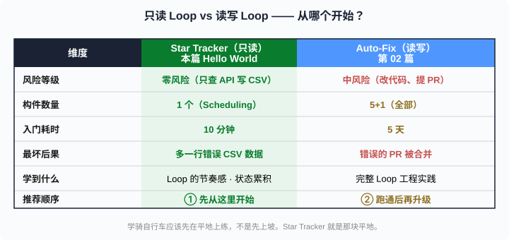
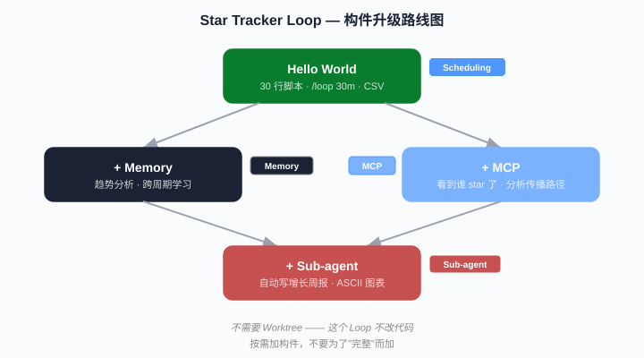

# Loop Engineering's Hello World — 30 Lines + One Command = GitHub Star Tracker

> Part 02's Auto-Fix Loop has 6 steps, 5 building blocks, and a 5-day onramp. This part uses **1 block (Scheduling) + 30 lines of bash + 1 Claude Code command** to build a working Loop in 10 minutes. If you've never written a Loop, start here.

**Jump to:** [Why this](#why-start-here) · [10-min build](#build-it-in-10-minutes) · [Upgrade path](#adding-blocks-incrementally) · [Real run](#real-run-log) · [Counter-intuitive conclusion](#counter-intuitive-conclusion)

## Why start here

Part 02 gave a "5-day onramp" starting from the simplest Loop. But many readers' reaction was: "Too complex — I don't have the confidence to run the Auto-Fix thing yet."

The problem is the example is too heavy. Bug fixing involves code comprehension, test verification, PR workflows — each step can fail. Beginners need a **Loop that can't possibly fail**:

- Doesn't modify code (read-only)
- Doesn't need MCP (one `gh api` call)
- Doesn't need Worktrees (no parallelism, no file conflicts)
- Doesn't need Sub-agents (no Maker/Checker)
- Doesn't even need Memory (the CSV file is the memory)

That's "monitor GitHub star growth" — **Loop Engineering's Hello World.**

## Target

A Loop that does something extremely simple:

```
Every 30 minutes:
  1. Hit GitHub API, get current stars / forks / watchers
  2. Append a row to a CSV file
  3. Compare with last check
  4. If changed: output a human summary ("gained 3 stars in the last 30 min")
  5. If unchanged: stay quiet, wait for next cycle
```

This Loop uses only **1 of the 5 blocks: Scheduling**. But it's a complete Loop — it has cadence, state (CSV), and a termination condition (you hit Ctrl-C).

## Build it in 10 minutes

### Step 1: Data collection script (3 min)

```bash
#!/usr/bin/env bash
# scripts/star-tracker.sh

set -euo pipefail

REPO="sky54laozhu/ai-frontier-notes"   # replace with your repo
CSV="$(dirname "$0")/star-history.csv"

# Create CSV header on first run
if [ ! -f "$CSV" ]; then
  echo "timestamp,stars,forks,watchers,open_issues" > "$CSV"
fi

# Fetch data
DATA=$(gh api "repos/$REPO" --jq \
  '[.stargazers_count, .forks_count, .subscribers_count, .open_issues_count] | @csv')
TIMESTAMP=$(date -u +"%Y-%m-%dT%H:%M:%SZ")

# Append to CSV
echo "${TIMESTAMP},${DATA}" >> "$CSV"

# Compare with previous
STARS=$(echo "$DATA" | cut -d',' -f1)

if [ "$(wc -l < "$CSV")" -gt 2 ]; then
  PREV_STARS=$(tail -2 "$CSV" | head -1 | cut -d',' -f2)
  DIFF=$((STARS - PREV_STARS))
  echo "⭐ Stars: $STARS (${DIFF:+$DIFF} since last check)"
else
  echo "⭐ Stars: $STARS (first record)"
fi
```

```bash
chmod +x scripts/star-tracker.sh
```

That's it. 30 lines. Only external dependency is `gh` (GitHub CLI), which you probably already have.

### Step 2: Manual test run (1 min)

```bash
$ ./scripts/star-tracker.sh
⭐ Stars: 0 (first record)

$ cat scripts/star-history.csv
timestamp,stars,forks,watchers,open_issues
2026-06-10T07:02:33Z,0,0,0,0
```

Works. CSV has data.

### Step 3: Hand it to Claude Code `/loop` (1 min)

```
/loop 30m Run ./scripts/star-tracker.sh to collect GitHub star data.
Read the last 5 rows of scripts/star-history.csv.
If stars grew, summarize the trend ("gained 15 stars in the past 2 hours, accelerating").
If unchanged 3 times in a row, say "no change, continuing to monitor."
```

**Done.** From now on, every 30 minutes Claude Code auto-runs the script, reads the CSV, and gives you a one-sentence summary. Go do something else.

### This is a Loop

| Loop trait | Auto-Fix Loop (Part 02) | Star Tracker (this part) |
|------------|------------------------|--------------------------|
| Has cadence | Every 15 min | Every 30 min |
| Has state | Memory files | CSV file |
| Has termination | All bugs fixed / budget spent | You hit Ctrl-C |
| Runs autonomously | ✅ | ✅ |
| Block count | 5+1 (all) | 1 (Scheduling) |

**The minimal Loop needs just one block: Scheduling.** The other four are for "making the Loop do more complex things," not for "making it run."

## Adding blocks incrementally

You now have a working Hello World Loop. To make it stronger, add blocks one at a time — **add one, observe, decide whether to add the next.**

### +Memory: trend analysis across cycles

Current Loop only sees "last check vs this check." With Memory it sees longer patterns:

```
/loop 30m Run ./scripts/star-tracker.sh.
Read all of scripts/star-history.csv.
Analyze trends:
- If growth in past 24h, calculate daily rate
- If any period shows acceleration, try to correlate
  ("3pm-5pm gained 12 stars, possibly related to your tweet")
- Write analysis to .claude/memory/star-trend.md
Next run: read .claude/memory/star-trend.md first, compare with new data.
```

### +MCP: see who starred

With GitHub MCP, the Loop sees not just counts but specific people:

```
/loop 30m After collecting star data, also fetch recent stargazers list.
If new stargazer: check their profile:
- Influential developer (followers > 100) → note in Memory
- Company employee (company in bio) → note in Memory
This helps understand which communities the content is reaching.
```

### +Sub-agent: auto-generate weekly reports

```
/loop 24h Read star-history.csv and star-trend.md.
Launch a sub-agent to write a weekly report:
- Star growth curve (ASCII art)
- Top 3 growth periods and likely causes
- Week-over-week comparison
- Next week prediction
Write report to docs/weekly/
```

### Upgrade path

```
Hello World (this part)
  │  Scheduling only
  │
  ├─ +Memory → trend analysis, cross-cycle learning
  │
  ├─ +MCP → see specific stargazers, trace spread paths
  │
  ├─ +Sub-agent → auto-generate growth reports
  │
  └─ +Skills → teach Loop your marketing strategy
      ("auto-tweet when stars hit 100")
```

Note: **no Worktree** in this path — this Loop doesn't modify code. Not every Loop needs all five blocks. **Add blocks as needed, not for "completeness."**

## Real run log

This Star Tracker Loop was built and run live while writing this article. First data point:

```csv
timestamp,stars,forks,watchers,open_issues
2026-06-10T07:02:33Z,0,0,0,0
```

Brand new repo, 0 stars. This row becomes the starting point of the entire growth curve.

If you're reading this, the repo already has some stars — and every step of that growth was recorded by the Loop in `scripts/star-history.csv`. Open that file to see the real timeline.

## Counter-intuitive conclusion

> **The best first Loop is a read-only Loop.**

Part 02's Auto-Fix Loop is "read-write" — it reads issues, writes code, modifies files, creates PRs. Any step going wrong has consequences. Beginners hesitate: "What if it messes up my code?"

Star Tracker is "read-only" — it queries an API and writes a CSV. **Worst case is one wrong data row. Delete it and move on.** It can't break anything. This zero-risk lets you confidently run it, observe Loop behavior patterns, build Loop intuition — then tackle read-write Loops.

**Learn to ride a bike on flat ground first, not uphill.** Star Tracker is that flat ground.

More counter-intuitively: **this 30-line Hello World already outperforms you.** You won't check GitHub stars every 30 minutes — but the Loop will. You won't record star changes at 3 AM — but the Loop will. You won't sustain 48 daily checks for a week — but the Loop will. **A Loop's value isn't being smarter than you — it's being more persistent than you.**

Most counter-intuitively: **this blog post is itself the object being monitored by the Loop.** The moment I pushed this article to GitHub, the Star Tracker Loop started recording the growth it generates. If you just starred this repo, the next 30-minute cycle will record you.

That's Loop Engineering in its simplest, most essential form — **you design the system, the system observes for you, continuously.**

---

## File listing

```
ai-frontier-notes/
├── scripts/
│   ├── star-tracker.sh          # 30-line collection script
│   └── star-history.csv         # Growth data (auto-appended by Loop)
└── .claude/memory/
    └── star-trend.md            # Trend analysis (after adding Memory block)
```

## Try it now

1. Fork [sky54laozhu/ai-frontier-notes](https://github.com/sky54laozhu/ai-frontier-notes) (or use any repo)
2. Change `REPO=` in `scripts/star-tracker.sh` to your repo
3. Run `./scripts/star-tracker.sh` to verify
4. In Claude Code:
   ```
   /loop 30m Run ./scripts/star-tracker.sh, read last 5 CSV rows, summarize changes.
   ```
5. Walk away. Come back in 30 minutes to see the Loop's report.

**Your first Loop. 10 minutes. Starting now.**

---

## Diagrams

1. 
2. 

---

📌 Reading map: [reading-map.md](../reading-map.md)
🔗 Chinese version: [zh/03-loop-hello-world-star-tracker.md](../zh/03-loop-hello-world-star-tracker.md)
🔗 Previous: [02 Loop Engineering in Practice](./02-loop-engineering-in-practice.md)
