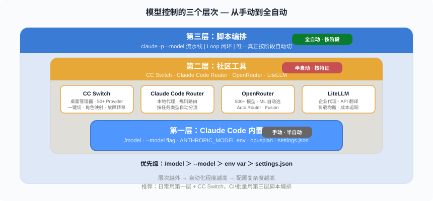
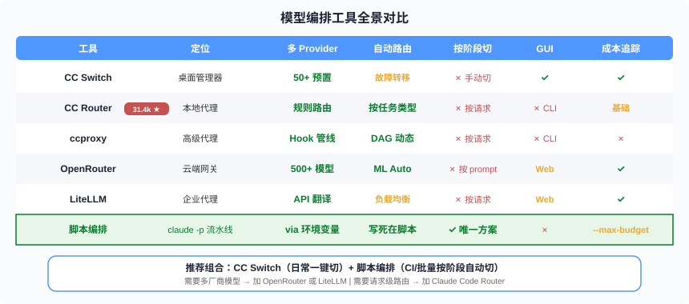
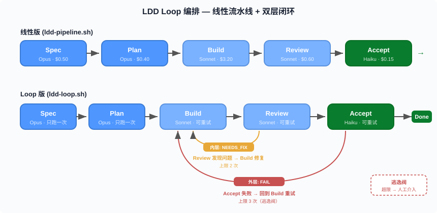

# Model Orchestration in Practice — Putting the Right Model on the Right Phase, Automatically

> The first six posts covered Loop Engineering theory (01), advanced patterns (02), Hello World (03), full-lifecycle LDD (04), Token economics (05), and debugging stalls (06). This post answers the practical gap left open in Post 05: **"Use Opus for Spec, Sonnet for Build, Haiku for Accept" — easy to say, but how do you automate it?** The answer is a three-layer combo: built-in mechanisms as the foundation, community tools for convenience, and script orchestration as the only true per-phase automation.

**Jump to:** [Problem](#problem-manual-model-wont-scale) · [Layer 1: Built-in](#layer-1-claude-code-built-in-mechanisms) · [Layer 2: Community Tools](#layer-2-community-tool-ecosystem) · [Layer 3: Script Orchestration](#layer-3-script-orchestration--the-only-true-per-phase-solution) · [Combo Play](#combo-play-three-layers-working-together) · [Counterintuitive Takeaways](#counterintuitive-takeaways)

## Problem: Manual /model Won't Scale

Post 05 laid out a clear model tiering strategy:

| Phase | Recommended Model | Rationale |
|-------|------------------|-----------|
| Spec/Plan | Opus | Deep reasoning — quality here determines everything downstream |
| Build | Sonnet | Coding workhorse — best cost/performance ratio |
| Review | Sonnet | Code review — good enough |
| Accept | Haiku | Acceptance testing — 5x cheaper and sufficient |

The prescribed method was manual `/model sonnet`, `/model opus`. In practice, three pain points:

1. **Forgetting to switch**: Building with Opus still active, $3 wasted before you notice
2. **Can't be scripted**: `/model` is an interactive command — it doesn't go into a shell script
3. **Wanting non-Anthropic models**: DeepSeek is cheap for coding, Gemini has 2M context — but Claude Code defaults to Anthropic API only

This post solves all three, layer by layer.



## Layer 1: Claude Code Built-in Mechanisms

Claude Code provides four ways to control the model, **in priority order (highest to lowest)**:

| Method | Scope | Scriptable? | Mid-session switch? |
|--------|-------|:-----------:|:-------------------:|
| `/model` command | Current session | No (manual) | Yes |
| `--model` CLI flag | Single invocation | **Yes** | No (set at launch) |
| `ANTHROPIC_MODEL` env var | Current shell | **Yes** | No |
| `model` in settings.json | Persistent default | **Yes** (edit file) | No |

### --model: The Key to Scripting

```bash
# Non-interactive mode, each invocation gets its own model
claude -p "Generate the spec" --model opus
claude -p "Implement the code" --model sonnet
claude -p "Run acceptance tests" --model haiku
```

This is the only official way to switch models per phase in a shell script. `-p` (print mode) makes Claude execute and exit — naturally isolating context, since each invocation is a separate session.

### Environment Variables: Alias Resolution

```bash
ANTHROPIC_MODEL               # Default model
ANTHROPIC_DEFAULT_OPUS_MODEL   # What /model opus resolves to
ANTHROPIC_DEFAULT_SONNET_MODEL # What /model sonnet resolves to
ANTHROPIC_DEFAULT_HAIKU_MODEL  # What /model haiku resolves to
CLAUDE_CODE_SUBAGENT_MODEL     # Model for subagents
```

### opusplan: Built-in Two-Tier Routing

```bash
claude --model opusplan
```

Entering Plan mode (`/plan`) automatically switches to Opus; exiting switches back to Sonnet. Zero config, covering the core "Opus for planning, Sonnet for execution" pattern.

### Limitations

**Hooks cannot change the model. CLAUDE.md cannot specify a model.** Model selection lives in the configuration layer, not the prompt layer. Inside an interactive session, nothing can automatically switch models based on "what you're currently doing."

### --fallback-model: Overload Degradation

```bash
claude -p "task" --model opus --fallback-model sonnet,haiku
```

Print mode only. If the primary model is overloaded, fallbacks are tried in order — useful in CI to keep the pipeline from stalling.

## Layer 2: Community Tool Ecosystem

Built-in mechanisms handle "can switch" but not "convenient switching" or "cross-provider switching." Community tools fill that gap.



### CC Switch — Desktop All-in-One Manager

[CC Switch](https://github.com/farion1231/cc-switch) is the most mature configuration management tool for Claude Code. Built with Tauri 2, cross-platform.

**Core capabilities:**

- **50+ provider presets**: AWS Bedrock, OpenRouter, DeepSeek, Kimi, GLM, Qwen, SiliconFlow, Volcengine — import with one click
- **One-click switching**: Click in the main UI or system tray; Claude Code supports hot-switching without terminal restart
- **Role mapping**: v3.15+ maps roles (sonnet/opus/haiku) to different models via `ANTHROPIC_DEFAULT_*_MODEL` env vars
- **Local proxy + automatic failover**: Provider A goes down, automatically switches to Provider B
- **Usage tracking**: Per-model/provider spend, request count, token stats with trend charts

**CC Switch's model mapping panel** maps directly to Post 05's strategy:

| CC Switch Field | Recommended Value | Corresponding Env Var |
|----------------|-------------------|----------------------|
| Main Model | `claude-sonnet-4-6` | `ANTHROPIC_MODEL` |
| Thinking Model | `claude-opus-4.6` | — |
| Haiku Default | `claude-haiku-4-5` | `ANTHROPIC_DEFAULT_HAIKU_MODEL` |
| Sonnet Default | `claude-sonnet-4-6` | `ANTHROPIC_DEFAULT_SONNET_MODEL` |
| Opus Default | `claude-opus-4.6` | `ANTHROPIC_DEFAULT_OPUS_MODEL` |

```bash
# macOS installation
brew install --cask cc-switch
```

> ⚠️ **Security warning**: Multiple imposter websites exist. **The only official site is ccswitch.io**, the only source is `farion1231/cc-switch`.

### Claude Code Router — Request-Level Auto-Routing

[Claude Code Router](https://github.com/musistudio/claude-code-router) (31.4k stars) is a local proxy at `127.0.0.1:3456` that intercepts Claude Code requests and routes them by rules.

**How it differs from CC Switch**: CC Switch is a configuration manager (you switch manually); Router is a proxy (it switches automatically based on rules).

- Routes by task type (background → Haiku, reasoning → Opus)
- Routes by context length (long context → Gemini 2M window)
- Supports OpenRouter, DeepSeek, Ollama, Gemini backends
- Developers report **50-99% cost reduction**

### ccproxy — Advanced Hook Pipeline

[ccproxy](https://github.com/starbased-co/ccproxy) operates at a lower level, using a DAG-driven hook pipeline. Its `model_router` hook dynamically rewrites the model field in requests. Can route long-context requests to Gemini, search requests to Perplexity — while Claude Code believes it's talking to the standard Anthropic API.

### OpenRouter — 500+ Model Cloud Gateway

[OpenRouter](https://openrouter.ai/) provides a single API endpoint fronting 500+ models from 60+ providers.

**Key routing capabilities:**

- **Auto Router** (`openrouter/auto`): ML meta-model analyzes your prompt and picks the optimal model
- **Fusion**: Sends the same prompt to multiple models, a judge model synthesizes the final answer
- **Model Fallbacks**: Automatic failover on error

**Connecting to Claude Code**: Set `ANTHROPIC_BASE_URL` to the OpenRouter endpoint.

### LiteLLM — Enterprise-Grade Proxy

[LiteLLM](https://docs.litellm.ai/) translates API formats. Claude Code speaks Anthropic protocol; the backend can be Azure, Bedrock, Vertex AI, or Ollama. The standard choice for enterprise compliance.

Set `CLAUDE_CODE_ENABLE_GATEWAY_MODEL_DISCOVERY=1` to populate the `/model` picker with LiteLLM-hosted models.

> ⚠️ **Note**: LiteLLM 1.82.7-1.82.8 (March 2026) had a supply-chain security incident — use >= 1.83.0. Non-Anthropic models in complex agentic tasks show degraded quality: tool-call accuracy, file path correctness, and multi-step reasoning all suffer.

### 9Router — Coding Tool Gateway

[9Router](https://github.com/9router/9router) is a local gateway at `localhost:20128` built specifically for AI coding tools (Claude Code, Codex, Cursor, Cline). Includes built-in token compression (claims 20-40% input token savings).

### Tool Selection Guide

| Your Need | Recommended Tool |
|-----------|-----------------|
| Lowest barrier, just start | Claude Code built-in `opusplan` |
| Convenient switching, want GUI | CC Switch |
| Want DeepSeek/Gemini for cost savings | Claude Code Router |
| Enterprise compliance, Azure/Bedrock | LiteLLM |
| Fully automatic optimal model selection | OpenRouter Auto Router |
| Per-phase automatic switching | **Script orchestration** (next section) |

## Layer 3: Script Orchestration — The Only True Per-Phase Solution

The first two layers share a common limitation: **they don't know which development phase you're in**. CC Switch switches when you click, Router routes by request characteristics, OpenRouter routes by prompt content — none can say "this is the Spec phase so use Opus, this is Build so use Sonnet."

**The only way to achieve per-phase automatic switching is shell script orchestration**: one `claude -p --model` call per phase.



### Linear Version: ldd-pipeline.sh

The simplest version — five phases execute sequentially, each with a different model, done when finished.

```bash
#!/usr/bin/env bash
set -euo pipefail

MODEL_SPEC="opus"
MODEL_PLAN="opus"
MODEL_BUILD="sonnet"
MODEL_REVIEW="sonnet"
MODEL_ACCEPT="haiku"

# Phase 1: Spec (Opus deep reasoning → docs/spec.md)
claude -p "Read CLAUDE.md. Generate docs/spec.md from requirements..." --model $MODEL_SPEC

# Phase 2: Plan (Opus deep reasoning → docs/plan.md)
claude -p "Read docs/spec.md, generate docs/plan.md..." --model $MODEL_PLAN

# Phase 3: Build (Sonnet coding workhorse)
claude -p "Read docs/plan.md, implement all tasks..." --model $MODEL_BUILD

# Phase 4: Review (Sonnet code review)
claude -p "Review code, git diff main...HEAD..." --model $MODEL_REVIEW

# Phase 5: Accept (Haiku acceptance testing)
claude -p "Read acceptance criteria from docs/spec.md, verify each..." --model $MODEL_ACCEPT
```

**Natural dual isolation:**

1. **Model isolation**: Each phase uses the best-fit model
2. **Context isolation**: `claude -p` creates a fresh session per call — no history baggage

This is the automated version of Post 05's "separate `/clear` per phase."

### Loop Version: ldd-loop.sh

The linear version's problem: what if Review finds bugs? What if Accept fails? — It runs once and stops, no feedback loop.

The Loop version adds Loop Engineering's core pattern — **dual-layer feedback loops + escape valve**:

```
Spec → Plan → ┌─→ Build → Review ──┐──→ Accept ──┐──→ Done
              │          ↑  │      │        │     │
              │          └──┘      │    FAIL │     │
              │      Inner Loop    │        │     │
              │    (NEEDS_FIX      │        │     │
              │     → Build fix)   │        │     │
              │                    │        │     │
              └────────────────────┘────────┘     │
                    Outer Loop                    │
                 (Accept fail → re-Build)        PASS
```

**Three key mechanisms:**

| Mechanism | Trigger | Behavior |
|-----------|---------|----------|
| **Inner Loop** | Review returns `NEEDS_FIX` | Build fixes only the issues Review identified, then re-Review |
| **Outer Loop** | Accept returns `FAIL` | Returns to Build with failure context for another attempt |
| **Escape Valve** | Exceeds `MAX_RETRIES` | Stops the loop, requests human intervention |

Core code snippet:

```bash
# Outer Loop: Build → Review → Accept
while [[ "$PIPELINE_RESULT" != "PASS" && $OUTER_ITER -lt $MAX_RETRIES ]]; do
  OUTER_ITER=$((OUTER_ITER + 1))

  # Build (first round: full implementation; later rounds: fix issues only)
  if [[ $OUTER_ITER -eq 1 ]]; then
    claude -p "Read plan, implement all tasks" --model sonnet
  else
    claude -p "Read accept/review reports, fix failures" --model sonnet
  fi

  # Inner Loop: Review → Fix
  REVIEW_ITER=0
  while [[ "$REVIEW_VERDICT" == "NEEDS_FIX" && $REVIEW_ITER -lt $MAX_REVIEW_FIXES ]]; do
    claude -p "Review code, output VERDICT: PASS or NEEDS_FIX" --model sonnet
    if [[ "$REVIEW_VERDICT" == "NEEDS_FIX" ]]; then
      claude -p "Fix the issues Review identified" --model sonnet
    fi
  done

  # Accept
  claude -p "Verify each acceptance criterion from spec" --model haiku
  # PASS → exit loop; FAIL → continue outer loop
done
```

**The escape valve is Loop Engineering's safety floor** — without it, AI can loop infinitely on the same bug. Defaults to 3 outer retries + 2 inner fixes; beyond that, it stops and asks a human to look.

### Usage

```bash
# Full five-phase + Loop feedback
./scripts/ldd-loop.sh "Build a URL shortener service with custom short codes"

# Dry run (preview without executing)
./scripts/ldd-loop.sh "anything" --dry-run

# Already have spec + plan, only run Build → Review → Accept loop
./scripts/ldd-loop.sh "anything" --skip-spec --skip-plan

# Allow more retries
./scripts/ldd-loop.sh "anything" --max-retries 5
```

## Combo Play: Three Layers Working Together

The three layers aren't mutually exclusive — they combine by scenario:

| Scenario | Recommended Combo | Rationale |
|----------|-------------------|-----------|
| **Daily interactive dev** | CC Switch + `opusplan` | Tray click for provider; opusplan for auto two-tier routing |
| **Batch tasks / CI** | `ldd-loop.sh` + `--fallback-model` | Script per-phase model; fallback prevents overload stalls |
| **Maximum cost optimization** | Claude Code Router + DeepSeek backend | Simple tasks auto-routed to cheap models |
| **Enterprise compliance** | LiteLLM + Azure/Bedrock | API translation through approved cloud services |
| **Multi-model deliberation** | OpenRouter Fusion | Important decisions get multi-model voting |

**Most common combo**: CC Switch for daily provider management + script orchestration for CI/batch. This covers 90% of scenarios.

## Counterintuitive Takeaways

> **The biggest waste isn't picking the wrong model — it's a pipeline without a feedback loop.**

You've got CC Switch, role mapping configured, the right model for each phase — but if Accept failures go unaddressed, if Review findings never loop back to Build, the money saved on model tiering won't cover the rework cost. Post 05 said "rework costs 10x more than model price difference"; this post adds the second half: **automated feedback loops are 10x faster than manual fixes.** Script orchestration's value isn't just "auto-switching models" — it's "auto-retrying until acceptance passes."

More counterintuitive: **more tools isn't better.** CC Switch + script orchestration already covers the vast majority of scenarios. Each additional proxy layer (Router + LiteLLM + OpenRouter) adds a failure point and a latency source. Unless you genuinely need "per-request auto-routing to non-Anthropic models," you don't need all three layers.

Most counterintuitive: **non-Anthropic models look cheaper, but quality loss in agentic scenarios can negate cost savings.** Claude Code's tool calling, file path parsing, and multi-step reasoning are optimized for Anthropic models. Switch to DeepSeek or Gemini for Build — per-token price drops, but tool-call failure rate rises → retry count increases → total tokens may actually increase. **Cheap model × more retries ≠ necessarily cheaper than expensive model × first-try success.** Don't assume "cheaper model = lower cost" until you've measured it.

---

## Diagrams

1. 
2. 
3. 

---

📌 Series reading map: [reading-map.md](../reading-map.md)
🔗 Previous: [06 Claude Code Stuck Guide](./06-claude-code-stuck-guide.md)
