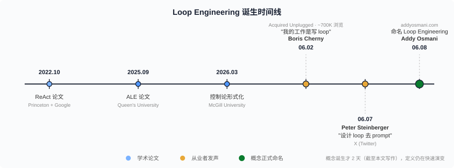
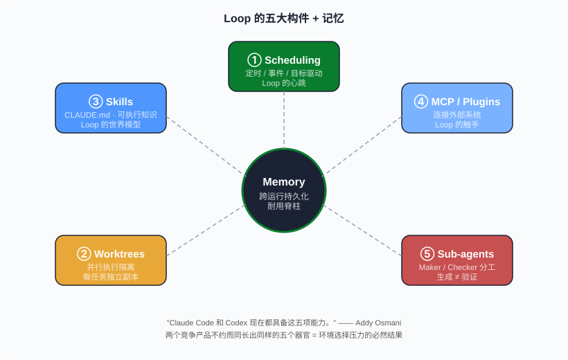
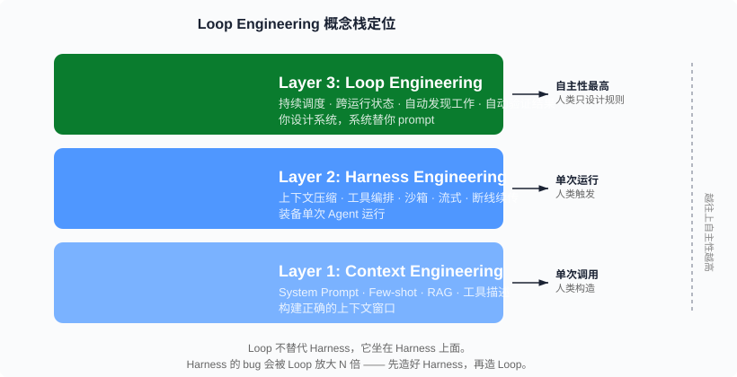

# Loop Engineering —— 从"我来 prompt"到"系统替我 prompt"的范式跳跃

> Boris Cherny 说"我不再 prompt Claude 了，我写 loop 让系统替我 prompt。"两天后 Addy Osmani 把这句话系统化成了一个新词。本文用造 Harness 的人的视角，把 Loop Engineering 从定义、起源、五大构件、学术根基、工程陷阱到概念栈定位全部拆一遍——每一处判断都有源可查。

**章节跳转：**[问题](#问题陈述) · [朴素方案](#朴素方案为什么不行) · [核心定义](#核心定义loop-engineering-是什么) · [五大构件](#五大构件--记忆) · [学术根基](#学术根基三条线) · [概念栈](#概念栈的定位) · [工程陷阱](#工程陷阱) · [反直觉结论](#反直觉结论)

## 问题陈述

2026 年 6 月 2 日，Boris Cherny —— Anthropic Claude Code 的负责人 —— 在 Acquired Unplugged 活动上说了一句话：

> *"I don't prompt Claude anymore. I have loops running that prompt Claude and figuring out what to do. My job is to write loops."*

这句话在 X 上被看了大约 70 万次。5 天后，Peter Steinberger（PSPDFKit 创始人，现供职于 OpenAI）发了另一句：

> *"You shouldn't be prompting coding agents anymore. You should be designing loops that prompt your agents."*

再过一天，2026 年 6 月 8 日，Addy Osmani（Google 工程总监）发了一篇长文，把上面两句话背后的工程实践命名为 **Loop Engineering**。

如果你只看 Twitter 热度，这不过是又一个流量词。但如果你造过 Agent Harness——我造过一个，60K 行代码、640 行的 Loop 核心——你会发现这个词精确地描述了一件正在发生的事：**开发者的核心工作正在从"写 prompt"变成"写生成 prompt 的系统"**。

这篇文章要回答的问题是：Loop Engineering 到底是什么，它从哪来，落地长什么样，跟你已经知道的概念有什么关系，以及它有哪些工程上的坑。

## 朴素方案为什么不行

在 Loop Engineering 之前，开发者跟 AI 编码代理的交互模式有三种。每种都走不远。

**方案一：手动逐轮 prompt。** 你坐在 Claude Code 前面，敲一段指令，等它执行完，看结果，再敲下一段。这是 2024-2025 年绝大多数开发者的日常。问题很明显：**你是瓶颈**。Agent 改完代码等你看，你看完等你想清楚下一步，想清楚再敲进去——你成了整条链上最慢的环节。而且你不在的时候（睡觉、开会、吃饭），Agent 什么也不干。

**方案二：写一个自动化脚本跑单次任务。** 比如"每次 CI 挂了就让 Agent 修"。这比方案一好，但它是**单点触发、单次执行**——脚本不会自己发现新工作，不会在修完之后验证是否真的修好了，不会把这次修复的经验带到下一次。一个 bash 脚本调 Claude API 不是"系统"，是一次性消耗品。

**方案三：套 LangChain / CrewAI / AutoGen 模板。** 这些框架解决了"多 Agent 如何编排"，但没解决"谁来决定何时启动编排、何时停止、下一个周期做什么"。框架给你的是**单次运行的脚手架**，不是持续运行的自主系统。你还是得自己来决定"今天跑什么任务"。

三种方案的共同 bug 是同一个：**人类依然是 turn-by-turn 的 prompter**。你要么亲手敲 prompt，要么亲手写一次性脚本触发 prompt，要么亲手组装框架然后手动启动。Agent 的能力上限被"你每天能 prompt 多少轮"卡住了。

Boris Cherny 的洞察是：**把"谁来 prompt"这个职责从人类手里拿走，交给一个递归的目标驱动系统**。这个系统自己发现工作、自己拆任务、自己交给 Agent、自己验证结果、自己决定下一步。人类的工作从"写 prompt"变成"设计这个系统"。

这就是 Loop Engineering。

## 核心定义：Loop Engineering 是什么

Addy Osmani 的原始定义：

> *"Loop engineering is replacing yourself as the person who prompts the agent. You design the system that does it instead. A loop here can be thought of a recursive goal where you define a purpose and the AI iterates until complete."*

翻译成工程语言：

> **Loop Engineering = 设计一个自主系统，让它代替你成为 AI 代理的 prompter。这个系统以递归目标驱动：发现工作 → 分配给 Agent → 验证结果 → 持久化状态 → 决定下一步，按计划或直到目标完成。**

跟"手动 prompt"的关系，就像"手动部署"跟"CI/CD"的关系。你不是不部署了，你是把部署逻辑写成了 pipeline，pipeline 自己跑。Loop Engineering 不是让你不用 prompt 了，是让你把 prompt 逻辑写成了 loop，loop 自己跑。

跟"单次自动化"的区别在两个字：**持续**。单次自动化是"我写个脚本让 Agent 修这个 bug"；Loop 是"我设计一个系统，它每 15 分钟扫一遍 issue 列表，发现新 bug 就开 worktree、派 Agent 修、跑测试验证、通过了自动提 PR、失败了自动收集错误信息进入下一轮"。Loop 有记忆、有节奏、有终止条件。

## 五大构件 + 记忆

Osmani 把一个完整的 Loop 拆成了 5+1 个结构原语。我用造 Harness 的经验逐一对照。

### 1. Automations / Scheduling（自动化调度）

Loop 的心跳。没有调度就没有"自主"——系统需要知道"什么时候该醒来看看有没有活干"。可以是 cron（每 15 分钟跑一次）、可以是事件驱动（PR 被创建时触发）、可以是目标驱动（直到所有测试通过才停）。

在 Claude Code 里这对应 `/loop` 命令和 cron 调度；在 HarWork 里这对应 `hooks/schedule.ts` + `agent/scheduler.ts`。

### 2. Worktrees（工作树隔离）

Loop 如果同时跑多个任务，它们会互相踩文件。Git worktree 是最便宜的隔离方案——每个任务在自己的工作副本里改代码，改完 merge 回来。没有隔离的 Loop 等于单线程——串行执行，浪费 Agent 的并发能力。

这正是 HarWork 系列第 11 篇讲的：per-user 持久 Docker 的本质就是"每个用户/任务有自己的隔离环境"。Osmani 选 worktree 是更轻量的方案，适合同一台机器上的并行 Agent。

### 3. Skills（技能/知识编码化）

Loop 需要知道"这个项目怎么跑测试"、"这个仓库的目录结构是什么"、"PR 应该怎么写"。这些知识不能每次都从头学——必须持久化成 Skills。Claude Code 的 `CLAUDE.md` + Skills 系统就是这个位置。

我在 HarWork 的 Day 5 就写了 `CLAUDE.md`，系列第 18 篇复盘时把它列为"4 件做对的事"之一。Osmani 把这个升级成了 Loop 的第三根柱子——**不是给人看的文档，是给 Loop 看的可执行知识**。

### 4. Plugins & Connectors / MCP（插件与连接器）

Loop 不能只会改代码——它需要读 Jira、查 Slack、翻 Grafana、看 CI 状态。MCP（Model Context Protocol）是 Anthropic 提出的工具连接标准，让 Agent 能伸手到代码仓库之外的任何系统。

没有 MCP 的 Loop 就像没有外设的 CPU：能算但看不见、听不到、摸不着。HarWork 在第 07 篇拆过的"9 方法工具接口"本质就是在解这个问题——**让 Loop 的触手能到达任何外部系统**。

### 5. Sub-agents（子代理）

一个 Loop 不应该自己干所有事。它应该把任务拆成子任务，交给专门的子 Agent：一个写代码、一个跑测试、一个做 code review。Osmani 特别强调了 **maker/checker 分工**——生成代码的 Agent 和验证代码的 Agent 必须是两个，否则"自己写自己检查"等于没检查。

这在 HarWork 系列第 05 篇的"工具编排：并行/串行/中断"里有完整对应：`yield* executeTools()` 把子任务扇出，每个子 generator 独立执行、独立汇报。

### +1. Memory / State（记忆/状态）

以上五个构件的粘合剂。Loop 跑完一个周期的发现、决策、教训必须持久化下来，下一个周期能读到。没有 Memory 的 Loop 是金鱼——每 15 分钟重新发现同一个 bug、重新犯同一个错。

HarWork 第 06 篇"长期记忆"拆的就是这件事：`CLAUDE.md` 加载链 + 三路径记忆系统。Osmani 把它定位为"跨对话持久化的耐用脊柱"——一个精确的比喻。

**Osmani 说："Claude Code 和 Codex 现在都具备这五项能力。"** 这不是巧合。当两个竞争产品不约而同长出同样的五个器官，说明这五个器官是环境选择压力的必然结果，不是谁抄谁。

## 学术根基：三条线

Loop Engineering 不是凭空冒出来的。它至少有三条学术/工业前身。

### 线一：ReAct 模式（Princeton + Google, 2022）

ReAct（Reason + Act）是现代 Agent Loop 的鼻祖。它定义了 **思考 → 行动 → 观察** 的迭代循环，直到满足退出条件。

```
思考: 我需要找到这个函数的定义
行动: grep -r "function handleAuth" src/
观察: 找到了 src/auth/handler.ts:42
思考: 现在我需要读这个文件来理解逻辑
行动: Read src/auth/handler.ts
观察: [文件内容]
...
```

原始论文是 Yao et al., arXiv:2210.03629, ICLR 2023。Google Cloud 架构中心文档这样描述：*"The agent operates in an iterative loop of thought, action, and observation until an exit condition is met."*

HarWork 第 03 篇那个 20 行的 async generator 骨架，本质就是一个 ReAct loop。**Loop Engineering 把 ReAct 从"单次 Agent 运行的内部循环"提升到了"系统级别的自主循环"。**

### 线二：控制论形式化（McGill University, 2026）

McGill 大学 2026 年 3 月的论文 *"A Control-Theoretic Foundation for Agentic Systems"*（Eslami & Yu, arXiv:2603.10779）把 Agent 系统形式化为**反馈控制回路**。他们提出了三个关键洞察：

1. **五级智能体层级**：从固定控制律（if-else）到运行时合成控制架构（Agent 自己设计自己的 Agent）。
2. **Agency 的形式定义**：runtime decision authority over elements of the control architecture——智能体性 = 运行时对控制架构元素的决策权限。
3. **四个耦合稳定性机制**：参数适应、内源切换、决策引发延迟、结构重配置。关键发现是——即使每个机制单独稳定，它们交互时也可能让整个系统不稳定。

第三点对 Loop Engineering 的工程意义是直接的：**你的 Loop 里每个组件单独测都是好的，组合起来可能会震荡**。做过分布式系统的人对这个不陌生——这就是"组合爆炸"的控制论版本。

### 线三：Agentic Loop Engineering / ALE（Queen's University, 2025）

Queen's University 2025 年 9 月的论文 *"Agentic Software Engineering: Foundational Pillars and a Research Roadmap"*（Hassan et al., arXiv:2509.06216）正式定义了 **Agentic Loop Engineering (ALE)** 作为一门工程学科。它的三个贡献：

1. 把 Agent 工作从**黑箱**变成**有纪律、可审计、可复现的工作流**，根植于 DevOps 原则。
2. 提出了声明式制品 **LoopScript**——用 YAML/DSL 定义 Agent 工作流 SOP。
3. 明确指出 Plan-Do-Assess-Review (PDAR) 循环不够充分——它只管单次执行，缺少跨任务学习和可追溯性。

ALE 用的是学术语言，Osmani 用的是从业者语言，但**描述的是同一件事**：Agent 的循环必须被工程化、必须可审计、必须能学习。

三条线的汇聚不是偶然。它说明"让 Agent 在 loop 里自主运行"不是某个人的灵感，而是**从理论到实践同时在各处浮现的工程需求**。

## 概念栈的定位

Loop Engineering 在一个三层概念栈里：

```
┌─────────────────────────────────────────────────────┐
│  Layer 3: Loop Engineering                          │
│  持续在调度上生成 Agent，跨运行共享状态               │
├─────────────────────────────────────────────────────┤
│  Layer 2: Harness Engineering                       │
│  装备单次 Agent 运行（上下文、工具、沙箱、流式）      │
├─────────────────────────────────────────────────────┤
│  Layer 1: Context Engineering                       │
│  构建正确的上下文窗口（system prompt、few-shot、RAG） │
└─────────────────────────────────────────────────────┘
```

Osmani 的原话：*"The harness equips a single agent run; the loop is what keeps poking agents on a schedule, spawning helpers, and feeding itself."*

用我造 Harness 的视角翻译：

- **Context Engineering** 解决的是"这一轮 LLM 调用看到什么"。对应 HarWork 第 04 篇的 5 层上下文压缩。
- **Harness Engineering** 解决的是"这一次 Agent 运行怎么跑起来"。对应 HarWork 全部 18 篇。
- **Loop Engineering** 解决的是"Agent 运行完了之后，下一次什么时候跑、跑什么、用上次的什么经验"。对应的是——造完 Harness 之后，下一步要造的东西。

这个分层帮你理清一件事：**Loop 不替代 Harness，它坐在 Harness 上面**。你的 Harness 如果连单次运行都搞不稳（断线不能续、上下文爆窗口、工具结果丢失），那 Loop 只会把问题放大——一个不稳定的单次运行乘以 100 次自动调度 = 灾难。

**先造好 Harness，再造 Loop。** 这是我 49 天造 Harness 最大的收获之一。

## 工程陷阱

Google Cloud 架构中心文档明确指出 loop pattern 的主要工程风险：

> *"If termination conditions are incorrect or subagents fail to produce required state, the loop runs indefinitely causing excessive costs, resource consumption, and system hangs."*

翻译成人话：**Loop 最怕的不是不跑，是停不下来。**

我从造 Harness 的经验出发，列 4 个 Loop Engineering 会踩的坑：

**陷阱一：无限循环烧钱。** Loop 的终止条件必须有硬性兜底——不能只依赖"Agent 判断任务完成了"。Agent 可能幻觉，认为自己改对了但测试还是挂的，于是进入"改 → 测 → 挂 → 改 → 测 → 挂"的死循环。**HarWork 的做法**：每个 Loop 有 `maxTurns`（最大轮次）和 `maxTokenBudget`（最大 token 预算），任何一个先到就强制停。这不优雅，但安全。

**陷阱二：记忆污染。** Loop 的 Memory 是跨周期共享的。如果第 3 周期写入了一条错误的记忆（"这个函数已经被删了"，但实际没有），第 4、5、6 周期全部会基于这条错误信息决策。**修复**：记忆必须有时间戳和置信度，读取时要做"verify against current state"——HarWork 第 06 篇讲的记忆验证机制在 Loop 场景下从"建议"变成了"必须"。

**陷阱三：Worktree 泄漏。** 每个 Loop 周期创建 worktree，如果 Agent 半途失败没清理，worktree 累积在磁盘上。10 个周期之后你的磁盘空间少了 5 GB，100 个周期之后 CI 机器挂了。**修复**：worktree 创建时注册到 cleanup 列表，周期结束（无论成功失败）都强制清理。Claude Code 的做法是"如果 Agent 没改任何文件，自动删除 worktree"——这是正确的默认值。

**陷阱四：Maker 和 Checker 用同一个模型同一个上下文。** 你让 Claude 写代码，再让同一个 Claude 实例 review 自己写的代码——它当然会说"看起来不错"。**修复**：Checker 必须在独立上下文中运行，最好用不同模型。Osmani 强调的 maker/checker 分工不是哲学偏好，是工程必需。HarWork 第 05 篇的"兄弟中断传播"机制——一个工具失败时自动取消同批其它工具——在 Loop 层面同样适用：一个 Checker 否决了，不需要等其它 Checker 跑完。

## 反直觉结论

> **Loop Engineering 的核心竞争力不是"让 Agent 自动跑"，是"让 Agent 自动停"。**

任何人都能写一个 `while (true) { callAgent() }` 让 Agent 跑起来。难的是让它在正确的时刻停下来——任务真的完成了、或者已经无法完成了、或者预算花完了、或者发现了需要人类决策的情况。停的时机、停的方式、停之前的状态保存、停之后的上下文传递——**这些决定 Loop 质量的 80% 代码，全在"怎么停"上**。

这跟 Harness 的反直觉结论是同一个结构：**Harness 的难点不在 LLM 调用，在"LLM 不调用的时候"；Loop 的难点不在启动 Agent，在"Agent 该停的时候"**。

更反直觉的：**Loop Engineering 这个词诞生才 2 天（截至本文写作时），但它描述的实践已经存在至少 18 个月**。Boris Cherny 不是 6 月 2 日才开始写 loop 的——Claude Code 的 `/loop` 命令、cron 调度、worktree 隔离、子 Agent 编排，全是过去一年多积累的工程。Osmani 做的是**命名**，不是**发明**。命名的价值在于：一旦一个工程实践有了名字，社区就能围绕它形成共识、建立最佳实践、辨别变体。"Loop Engineering"这五个字的价值不在于它说了什么新东西，在于**它让一群人发现自己一直在做同一件事**。

最反直觉的：**Loop Engineering 让"造 Harness"变得更重要，而不是更不重要。** 表面上看，Loop 是 Harness 的上层，有了 Loop 还要 Harness 干嘛？但实际上 Loop 会把 Harness 的每一个 bug 放大 N 倍——N 等于 Loop 的运行周期数。手动 prompt 时你看到 Agent 犯了一次错可以手动纠正；Loop 里 Agent 犯了同样的错会被自动重复 100 次。**Loop 是 Harness 质量的倍增器，好的倍增，坏的也倍增**。

这就是为什么我在做完 18 篇 Harness 拆解之后，把 Loop Engineering 作为下一个系列的起点——不是因为它是新概念，是因为**它是 Harness 的自然延伸，也是 Harness 质量的终极试金石**。

## 信源与注意事项

本文所有事实性声明均经过三票制对抗验证（3 个独立验证 Agent 投票，2/3 以上同意才保留）。以下 3 条声明被驳回：

- "AI 编码代理之间的质量差异主要由 loop 设计而非底层模型决定" —— 0-3 驳回（过于绝对）
- "Anthropic 将 loops 命名为 10 年后最骄傲的功能" —— 0-3 驳回（无法验证的二手传述）
- 某些关于 loop 五组件的特定分类方式 —— 1-2 驳回（源自单一商业博客）

**时效性警告**：Loop Engineering 作为命名概念在本文写作时仅诞生 2 天（2026-06-08）。定义、框架和社区共识仍在快速演变。本文记录的是"这个词刚被造出来时的快照"，不是稳定的工程标准。

**主要来源：**

- Addy Osmani 原始博文：[addyosmani.com/blog/loop-engineering](https://addyosmani.com/blog/loop-engineering/)
- Google Cloud 架构中心 loop pattern：[cloud.google.com/architecture/choose-design-pattern-agentic-ai-system](https://cloud.google.com/architecture/choose-design-pattern-agentic-ai-system)
- McGill 控制论形式化：[arXiv:2603.10779](https://arxiv.org/pdf/2603.10779)
- Queen's University ALE 论文：[arXiv:2509.06216](https://arxiv.org/pdf/2509.06216)
- ReAct 原始论文：Yao et al., arXiv:2210.03629, ICLR 2023
- MindStudio 解读：[mindstudio.ai/blog/what-is-loop-engineering-ai-coding-agents](https://www.mindstudio.ai/blog/what-is-loop-engineering-ai-coding-agents)
- Cobus Greyling 汇编：[github.com/cobusgreyling/loop-engineering](https://github.com/cobusgreyling/loop-engineering)

---

## 配图

1. 
2. 
3. 

📌 本文基于 105 个 Agent 并行调研、22 个源、108 条声明提取、25 条三票验证（22 确认 / 3 驳回）的深度研究数据撰写。
