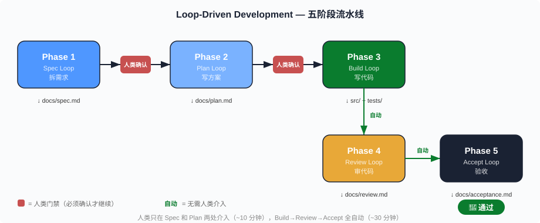
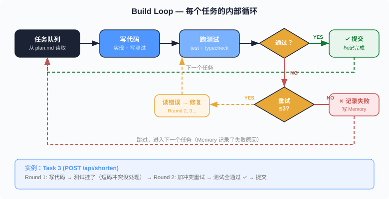
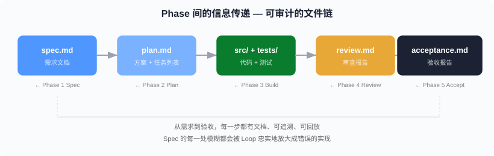

# Loop-Driven Development —— 用 Loop Engineering 跑完从 Spec 到验收的全过程

> 前三篇讲了 Loop Engineering 是什么（01）、怎么造复杂 Loop（02）、怎么 10 分钟跑通 Hello World（03）。这一篇回答一个更大的问题：**能不能用 Loop Engineering 跑完一个项目从 Spec 到验收的全过程？** 答案是能——但不是一个 Loop，是**五个 Loop 串联成一条流水线**。我们用"造一个短链接服务"做例子，从零走到上线。

**章节跳转：**[核心思路](#核心思路不是一个-loop是五个) · [例子定义](#例子短链接服务-linkshort) · [Phase 1 Spec](#phase-1-spec-loop拆需求) · [Phase 2 Plan](#phase-2-plan-loop写方案) · [Phase 3 Build](#phase-3-build-loop写代码) · [Phase 4 Review](#phase-4-review-loop审代码) · [Phase 5 Accept](#phase-5-accept-loop验收) · [完整编排](#五个-loop-的编排) · [反直觉结论](#反直觉结论)

## 核心思路：不是一个 Loop，是五个

第 02 篇的 Auto-Fix Loop 是**单阶段循环**——它只做一件事（修 bug），反复做。但"从 Spec 到验收"涉及五个本质不同的阶段，每个阶段的输入、输出、成功标准、所需能力都不一样：

| 阶段 | 输入 | 输出 | 成功标准 |
|------|------|------|---------|
| **Spec** | 一句话需求 | 结构化需求文档 | 人类确认"对，就是这个" |
| **Plan** | 需求文档 | 实现方案 + 任务列表 | 人类确认方案可行 |
| **Build** | 任务列表 | 可运行的代码 + 测试 | 所有测试通过 |
| **Review** | 代码 diff | 审查报告 + 修复 | 零 blocker 级问题 |
| **Accept** | 完整系统 | 验收报告 | 所有验收条件通过 |

把这五个阶段塞进一个 Loop 是错误的——就像把"设计建筑图纸"和"砌砖"塞进同一个工序。正确做法是**每个阶段一个 Loop，前一个 Loop 的输出是后一个 Loop 的输入**：



每个 Loop 内部可以多轮迭代（比如 Build Loop 对每个任务循环"写代码 → 跑测试 → 测试挂了 → 修 → 再跑"），但 Loop 之间是**串行的、有门禁的**——前一个阶段的输出必须经过确认才进入下一个阶段。

**这就是 Loop-Driven Development（LDD）。**

## 例子：短链接服务 LinkShort

我们用一个具体项目跑完全程。需求一句话：

> "做一个短链接服务，能把长 URL 变成短链接，点击短链接跳转到原始 URL，能看到点击统计。"

技术选型（写在 `CLAUDE.md` 里）：
- **后端**：Node.js + Hono（轻量 HTTP 框架）
- **数据库**：SQLite + Drizzle ORM
- **测试**：Vitest
- **部署**：Docker

下面一个阶段一个阶段走。

## Phase 1: Spec Loop——拆需求

**目标**：把一句话需求变成结构化的需求文档。

**Loop Prompt**：

```
/loop 5m 你是一个产品经理。根据这个需求，生成结构化需求文档：

需求：做一个短链接服务，能把长 URL 变成短链接，点击短链接跳转到原始 URL，能看到点击统计。

要求：
1. 列出所有 API 端点（method、path、request/response 格式）
2. 列出数据模型（表结构、字段、类型、约束）
3. 列出边界条件（URL 格式校验、短码冲突处理、过期策略）
4. 列出非功能需求（并发、响应时间、短码长度）
5. 列出验收条件（可自动化验证的条件列表）

写到 docs/spec.md。
写完后读一遍 docs/spec.md，检查是否有矛盾或遗漏。
如果发现问题，修复后再检查，直到你认为没有遗漏。
```

**这个 Loop 的特点**：
- 构件只用了 **Scheduling + Skills**
- Loop 内部有自检循环（"检查 → 发现问题 → 修复 → 再检查"）
- **终止条件**：Agent 自己认为没有遗漏（软终止），或 5 分钟超时（硬终止）

**人类门禁**：Loop 结束后，你读 `docs/spec.md`，确认需求正确。这一步**必须人类做**——Agent 不知道你的业务上下文。

**产出示例**（`docs/spec.md` 片段）：

```markdown
## API 端点

### POST /api/shorten
创建短链接
- Request: { "url": "https://example.com/very-long-url", "expireIn": "7d" }
- Response: { "shortCode": "abc123", "shortUrl": "https://lnk.sh/abc123" }
- 400: URL 格式无效
- 409: 自定义短码已存在

### GET /:code
重定向到原始 URL
- 301 Redirect
- 404: 短码不存在或已过期

### GET /api/stats/:code
获取点击统计
- Response: { "clicks": 42, "createdAt": "...", "lastClickAt": "..." }

## 验收条件
1. POST /api/shorten 返回有效短码（6 位字母数字）
2. GET /:code 301 跳转到正确的 URL
3. GET /api/stats/:code 返回正确的点击数
4. 相同 URL 重复提交返回相同短码
5. 过期链接返回 404
6. 无效 URL 返回 400
7. 并发 100 请求不丢数据
```

## Phase 2: Plan Loop——写方案

**目标**：把需求文档变成可执行的实现方案和任务列表。

**Loop Prompt**：

```
读取 docs/spec.md。
你是一个技术架构师。根据需求文档，生成实现方案：

1. 目录结构（列出每个文件的用途）
2. 数据库 schema（Drizzle ORM 格式）
3. 任务列表（每个任务是独立可提交的，包含验证标准）
4. 任务之间的依赖关系（哪些必须先做）
5. 估算每个任务的复杂度（S/M/L）

写到 docs/plan.md。
用 TaskCreate 把每个任务录入任务系统，设置好依赖关系。
```

**这个 Loop 的特点**：
- 用了 **Skills**（读 CLAUDE.md 了解技术栈）+ **Memory**（读 spec.md）
- 产出既有文档（plan.md）也有结构化数据（任务系统）
- 单次执行，不需要多轮——规划阶段的迭代在人类审核后发生

**产出示例**（任务列表）：

```
Task 1: [S] 初始化项目结构 + package.json + tsconfig
Task 2: [S] 定义数据库 schema（links 表 + clicks 表）
Task 3: [M] 实现 POST /api/shorten（生成短码 + 存储）
Task 4: [S] 实现 GET /:code（查找 + 301 重定向 + 记录点击）
Task 5: [S] 实现 GET /api/stats/:code（聚合点击数据）
Task 6: [M] 边界处理（URL 校验、短码冲突、过期检查）
Task 7: [M] 写测试（覆盖 spec 中的 7 个验收条件）
Task 8: [S] Dockerfile + docker-compose.yml

依赖: 1 → 2 → 3 → 4 → 5 → 6（线性）; 7 依赖 3,4,5; 8 独立
```

**人类门禁**：你审查 plan.md，确认方案合理。可能的修改："Task 3 和 Task 4 可以并行"、"加一个 Task: 限流中间件"。

## Phase 3: Build Loop——写代码

**目标**：按任务列表逐个实现，每个任务"写代码 → 跑测试 → 通过"。

**这是最复杂的 Loop，用到了全部五大构件。**

**Loop Prompt**：

```
你是一个全栈开发者。读取 docs/plan.md 和任务列表。

对每个未完成的任务，按以下流程执行：

1. 读取任务描述和依赖（确认前置任务已完成）
2. 在 worktree 中开始工作（基于 main 分支）
3. 实现代码（遵循 CLAUDE.md 中的代码规范）
4. 写测试（覆盖任务描述中的验证标准）
5. 运行 pnpm test —— 必须全部通过
6. 运行 pnpm typecheck —— 必须无错误
7. 通过 → 提交到 feature 分支 → 标记任务完成
8. 失败 → 读错误信息 → 修复 → 回到第 5 步（最多 3 轮）
9. 3 轮都失败 → 记录失败原因到 Memory → 跳到下一个任务

每完成一个任务，汇报进度。
所有任务完成后，合并所有 feature 分支到 main。
```

**构件映射**：

| 构件 | 在 Build Loop 中的角色 |
|------|----------------------|
| Scheduling | 自动按任务列表顺序执行 |
| Skills | CLAUDE.md 代码规范 + plan.md 方案 |
| Worktrees | 每个任务在独立分支，避免互相干扰 |
| Sub-agents | 可选：大任务拆成子任务让子 Agent 并行 |
| Memory | 记录已完成任务、失败原因、修复经验 |

**Build Loop 内部的子循环**：



**这里不需要人类门禁**——测试通过是客观标准。但如果 3 轮都失败，Loop 会停下来（写到 Memory），等人类介入。

## Phase 4: Review Loop——审代码

**目标**：独立审查 Build Loop 产出的代码，找出测试没覆盖的问题。

**Loop Prompt**：

```
你是一个独立的代码审查员。你没有参与开发过程。

1. 读取 docs/spec.md（了解需求）
2. 读取 docs/plan.md（了解设计）
3. 运行 git diff main...HEAD 查看所有改动
4. 对每个文件审查：
   - 是否符合 spec 需求（功能正确性）
   - 是否有安全问题（SQL 注入、XSS、路径穿越）
   - 是否有性能问题（N+1 查询、内存泄漏）
   - 是否有边界未处理（空值、超长输入、并发）
5. 对每个问题：
   - 严重程度（blocker / warning / nit）
   - 具体位置（文件:行号）
   - 修复建议
6. 写审查报告到 docs/review.md

如果有 blocker 级问题：
  - 启动一个 Sub-agent 修复每个 blocker
  - 修复后重新审查该文件
  - 直到零 blocker

如果只有 warning/nit：
  - 列在报告里，不阻塞
```

**关键设计**：

- **独立上下文**：Review Loop 的 Agent **没有看过 Build Loop 的过程**，只看最终的 diff。这就是第 01 篇讲的 Maker/Checker 分工。
- **Blocker 自动修复**：如果发现严重问题，Loop 内部启动 Sub-agent 修复，然后重新审查——不需要人类介入。
- **非 Blocker 不阻塞**：warning 和 nit 记录在报告里，人类后续可以选择处理或忽略。

**产出示例**（`docs/review.md` 片段）：

```markdown
## 审查结果

### Blockers (0) ✅
无

### Warnings (2)
1. **src/routes/shorten.ts:23** — 短码生成用了 Math.random()，
   在高并发下碰撞率偏高。建议改用 nanoid。
   严重程度: warning

2. **src/routes/redirect.ts:15** — 点击记录是同步写入，
   会拖慢重定向响应。建议改为异步写入。
   严重程度: warning

### Nits (1)
1. **src/db/schema.ts:8** — `createdAt` 用了 string 类型，
   建议用 integer (unix timestamp) 更高效。
```

## Phase 5: Accept Loop——验收

**目标**：对照 Spec 中的验收条件，逐条验证系统是否满足。

**Loop Prompt**：

```
你是一个 QA 工程师。读取 docs/spec.md 中的验收条件列表。

1. 启动服务: pnpm dev
2. 对每个验收条件，编写并执行验证脚本：

验收条件 1: "POST /api/shorten 返回有效短码（6 位字母数字）"
→ curl -X POST http://localhost:3000/api/shorten -d '{"url":"https://example.com"}'
→ 检查响应中 shortCode 是否为 6 位 [a-zA-Z0-9]

验收条件 2: "GET /:code 301 跳转到正确的 URL"
→ curl -I http://localhost:3000/{上一步的shortCode}
→ 检查状态码 301，Location 头是 https://example.com

... 对每个条件重复 ...

3. 结果写到 docs/acceptance.md：
   - 每个条件: ✅ 通过 / ❌ 失败 + 具体错误
   - 总计: X/Y 通过
   - 如果有失败项，分析原因并建议修复方向

4. 全部通过 → 输出 "🎉 验收通过"
5. 有失败项 → 尝试修复（最多 2 轮）→ 重新验证
```

**验收条件全部来自 Phase 1 的 Spec**——这是闭环。Spec Loop 定义了"什么算完成"，Accept Loop 验证"是否真的完成了"。

**产出示例**（`docs/acceptance.md`）：

```markdown
## 验收报告

| # | 验收条件 | 结果 | 备注 |
|---|---------|------|------|
| 1 | POST 返回有效短码 | ✅ | shortCode: "xK9mZp" |
| 2 | GET 301 跳转正确 | ✅ | Location: https://example.com |
| 3 | Stats 返回正确点击数 | ✅ | clicks: 1 (验证了一次点击) |
| 4 | 相同 URL 返回相同短码 | ✅ | 两次请求返回同一个码 |
| 5 | 过期链接返回 404 | ✅ | 设置 1s 过期后测试 |
| 6 | 无效 URL 返回 400 | ✅ | "not-a-url" → 400 |
| 7 | 并发 100 请求不丢数据 | ✅ | 100 并发，100 条记录 |

**结果: 7/7 通过 🎉**
```

## 五个 Loop 的编排

把五个 Phase 串起来，完整的 Loop-Driven Development 流水线（见 Phase 流水线配图）。

**关键设计决策**：

1. **Phase 1→2 和 Phase 2→3 之间有人类门禁**——需求和方案必须人类确认。Agent 不知道你的业务上下文（"短码要不要支持自定义？""统计要不要分国家？"），这些决策只有人类能做。

2. **Phase 3→4 和 Phase 4→5 之间没有门禁**——Build 到 Review 到 Accept 是全自动的。测试通过是客观标准，代码审查有明确规则，验收条件在 Spec 里已经定义好了。

3. **每个 Phase 内部可以多轮迭代**——Build Loop 每个任务最多重试 3 轮，Review Loop 的 blocker 修复后重新审查，Accept Loop 失败项修复后重新验证。

4. **Phase 之间的信息传递靠文件**——`docs/spec.md` → `docs/plan.md` → 代码 → `docs/review.md` → `docs/acceptance.md`。每个 Phase 读取上一个 Phase 的产出文件。这比用 Memory 更可靠——文件是持久化的、可版本控制的、人类可读的。

## 实际操作：用 Claude Code 跑完全程

如果你现在就想试，完整的操作序列：

```bash
# 0. 初始化项目
mkdir linkshort && cd linkshort && git init
# 写好 CLAUDE.md（技术栈、规范）

# 1. Spec Loop
claude -p "读取 CLAUDE.md。根据需求'短链接服务'生成 docs/spec.md..."
# → 人类审核 docs/spec.md → 确认 OK

# 2. Plan Loop  
claude -p "读取 docs/spec.md，生成 docs/plan.md 和任务列表..."
# → 人类审核 docs/plan.md → 确认 OK

# 3. Build Loop（这个最长，可以 /loop 让它自动跑）
claude -p "读取 docs/plan.md，逐个实现任务..."
# → 自动执行，测试驱动，每个任务跑通才继续

# 4. Review Loop
claude -p "独立审查代码，对照 spec 检查正确性和安全性..."
# → 自动修复 blocker，输出 docs/review.md

# 5. Accept Loop
claude -p "启动服务，逐条验证 spec 中的验收条件..."
# → 输出 docs/acceptance.md → 🎉
```

**总耗时估算**（以 LinkShort 为例）：

| Phase | Agent 耗时 | 人类耗时 | 说明 |
|-------|-----------|---------|------|
| Spec | 2 分钟 | 5 分钟审核 | Agent 快，人类审核是关键 |
| Plan | 3 分钟 | 5 分钟审核 | 同上 |
| Build | 15-30 分钟 | 0（全自动） | 8 个任务，每个 2-4 分钟 |
| Review | 5 分钟 | 0（全自动） | 含 blocker 修复 |
| Accept | 3 分钟 | 0（全自动） | 7 个验收条件 |
| **总计** | **~40 分钟** | **~10 分钟** | 人类只需在两个门禁点介入 |

一个人类开发者从零做完同样的事，保守估计 **4-6 小时**。Loop-Driven Development 把人类时间压缩到 10 分钟——省下来的不是 Agent 的时间（那是 token 成本），是**你的时间**。

## 反直觉结论

> **Loop-Driven Development 的瓶颈不在 Build，在 Spec。**

大多数人直觉认为"写代码最慢"。但实际上 Build Loop 是全自动的——Agent 写代码、跑测试、修 bug、提交，人类一秒都不用花。**真正慢的是 Spec 阶段的人类审核**。

为什么？因为 Spec 决定了后面所有阶段的方向。如果 Spec 写了"短码 6 位"但你其实想要 8 位，Build Loop 会忠实地实现 6 位，Review Loop 会确认 6 位是正确的，Accept Loop 会验证 6 位通过——然后你看到最终产品说"不对，我要 8 位"，整条流水线白跑。

**Spec 的每一处模糊都会被 Loop 忠实地放大成错误的实现。** 这是第 01 篇的核心洞察在全生命周期上的映射：Loop 会把 Harness 的每一个 bug 放大 N 倍；同理，Loop 会把 Spec 的每一个模糊放大为一个错误的功能。

更反直觉的：**人类门禁越少越快，但不是越少越好。** 去掉 Phase 1→2 的门禁（让 Agent 自己决定技术方案），能省 5 分钟人类时间。但如果 Agent 选了一个你不喜欢的技术栈，整条流水线的产出都需要推翻。**两个门禁是最优解**——Spec 确认需求正确，Plan 确认方案可行，之后全自动。少一个门禁太冒险，多一个门禁太慢。

最反直觉的：**Loop-Driven Development 不是"替代开发者"，是"把开发者变成产品经理 + 架构师"。** 你不再写代码了——你写 Spec、审方案、验收产品。你的角色从"实现者"变成了"决策者"。这不是降级，是升级——你花 10 分钟做的决策，驱动了 40 分钟的自动化执行。**你的杠杆率从 1:1（写一行代码产出一行代码）变成了 1:N（写一行 Spec 产出 N 行代码）。**

这就是 Boris Cherny 说的"我的工作是写 loop"在全生命周期上的终极形态：**你不写代码，你写规则；Loop 不只执行一个任务，它执行整个项目。**

---

## 完整文件清单

一个 Loop-Driven Development 项目的标准产出：

```
linkshort/
├── CLAUDE.md                    # 技术栈 + 规范（Loop 的世界模型）
├── docs/
│   ├── spec.md                  # Phase 1 产出：需求文档
│   ├── plan.md                  # Phase 2 产出：实现方案 + 任务列表
│   ├── review.md                # Phase 4 产出：代码审查报告
│   └── acceptance.md            # Phase 5 产出：验收报告
├── src/                         # Phase 3 产出：代码
│   ├── index.ts
│   ├── routes/
│   ├── db/
│   └── ...
├── tests/                       # Phase 3 产出：测试
│   └── ...
├── Dockerfile                   # Phase 3 产出
└── .claude/memory/              # 跨 Phase 的经验积累
```

**注意 docs/ 目录有四个文件**——每个门禁阶段一个。这四个文件就是 Loop-Driven Development 的"可审计链"：从需求到验收，每一步都有文档、可追溯、可回放。

---

## 配图

1. 
2. 
3. 

---

📌 系列阅读地图：[reading-map.md](../reading-map.md)
🔗 上一篇: [03 Hello World: 星标监控](./03-loop-hello-world-star-tracker.md)
