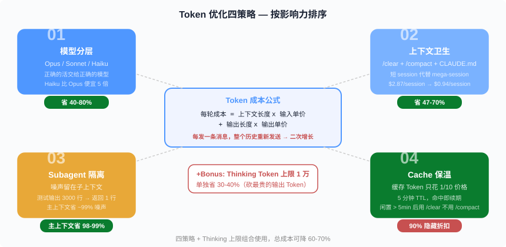
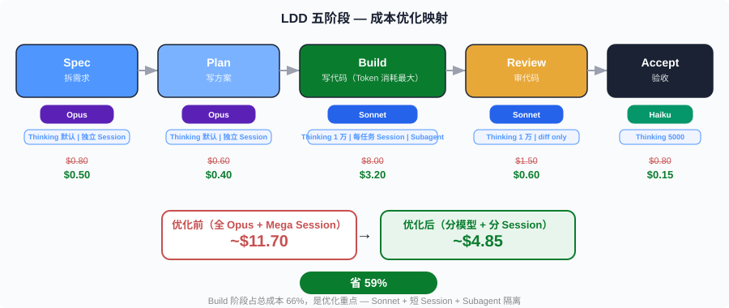
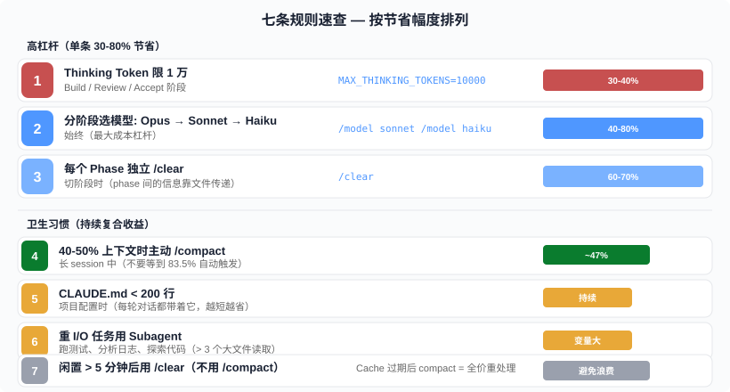

# Token 经济学 —— Claude Code 全流程开发的成本优化手册

> 前四篇讲了 Loop Engineering 的理论（01）、复杂 Loop 实战（02）、Hello World 入门（03）、全生命周期 LDD（04）。这一篇回答一个绕不开的现实问题：**用 Claude Code 跑完全流程，Token 怎么省、钱怎么花？** 答案不是"少用 AI"——而是**在正确的阶段用正确的模型，在正确的时机管理上下文**。

**章节跳转：**[问题](#问题一次-build-session-烧掉-200-万-token) · [朴素方案](#朴素方案哪里都省) · [核心方案](#核心方案分阶段分模型分上下文) · [策略一：模型分层](#策略一模型分层——正确的活交给正确的模型) · [策略二：上下文卫生](#策略二上下文卫生——每轮对话都在为上下文买单) · [策略三：Subagent 隔离](#策略三subagent-隔离——把噪声关在子房间里) · [策略四：Prompt Cache 保温](#策略四prompt-cache-保温——90-的隐藏折扣) · [LDD 五阶段实操](#回到-ldd用五阶段流水线实操省钱) · [反直觉结论](#反直觉结论)

## 问题：一次 Build Session 烧掉 200 万 Token

第 04 篇的 LinkShort 项目，五阶段 Loop 跑完 ~40 分钟。如果全程用 Opus、不做任何优化、一个 mega-session 跑到底——累计输入 Token 可以达到 **200 万**。按 Opus 4.8 定价（$5/MTok 输入、$25/MTok 输出），一个小项目轻松花掉 $10-15。

这不是极端情况。企业数据显示，开发者平均 **$13/活跃天**、$150-250/月。但 90% 的人可以控制在 **$30/天以内**——差距在于是否做了成本优化。

**Token 成本的根本公式**：

```
每轮成本 = (系统 Prompt + CLAUDE.md + 上下文历史 + 工具定义) × 输入单价
          + (Thinking Token + 输出文本 + 工具调用) × 输出单价
```

关键洞察：**每发一条消息，整个对话历史都要重新发送**。第 1 轮发送 1 万 Token，第 10 轮发送 10 万 Token，第 50 轮发送 50 万 Token——**成本是二次增长的**，不是线性的。

## 朴素方案："哪里都省"

大多数人的第一反应：

1. 少跟 AI 说话（减少交互次数）
2. 每次都用最便宜的模型
3. Prompt 写得尽量短
4. 不用 Subagent（因为"听说更贵"）

**这为什么不行**：

- **少说话 = 少产出**。你花钱买 Claude Code 就是为了让它干活，减少交互等于减少产出。
- **最便宜的模型做复杂决策 = 返工**。Haiku 写 Spec，Spec 质量差，Build Loop 会忠实地实现错误的需求（第 04 篇的核心洞察），整条流水线白跑——**返工比模型差价贵 10 倍**。
- **Prompt 太短 = 探索浪费**。"改一下 auth" 会让 Claude 扫描整个项目找 auth 相关文件，消耗的 Token 远超你省下的那几十个 Token。
- **不用 Subagent = 主上下文膨胀**。测试输出、日志、代码探索全堆在主线程，后续每轮对话都带着这些噪声——越往后越贵。

朴素方案的错误在于**把"花得少"等同于"花得值"**。正确目标是花同样的钱做更多的事，或者做同样的事花更少的钱。

## 核心方案：分阶段、分模型、分上下文

四个策略，按影响力排序：



## 策略一：模型分层——正确的活交给正确的模型

2026 年中，Anthropic 的三个模型定价：

| 模型 | 输入 ($/MTok) | 输出 ($/MTok) | 倍率（相对 Haiku） |
|------|:---:|:---:|:---:|
| **Haiku 4.5** | $1 | $5 | 1x |
| **Sonnet 4.6** | $3 | $15 | 3x |
| **Opus 4.8** | $5 | $25 | 5x |

5 倍的价格差意味着**模型选择是最大的成本杠杆**。

**实操规则**：

- **需要深度推理的阶段用 Opus**：Spec 拆需求、Plan 写方案、复杂 Bug 的 root cause 分析。这些阶段的质量直接决定后续所有阶段的正确性——**在 Spec 上省 $1，可能在 Build 上浪费 $10**。
- **80% 的编码工作用 Sonnet**：写代码、跑测试、代码审查。Sonnet 4.6 在代码生成上与 Opus 差距很小，价格便宜 40%。
- **简单判断用 Haiku**：验收测试执行、格式化、重命名、JSON 转换。Haiku 便宜 5 倍，这些任务它绰绰有余。

在 Claude Code 中切模型：

```bash
# 切模型
/model sonnet
/model opus
/model haiku

# 或者用 opusplan 模式：Plan 阶段用 Opus 推理，生成阶段自动切 Sonnet
```

**注意**：Opus 4.7+ 使用了新的 Tokenizer，同样的文本会多消耗约 **35% 的 Token**。所以 Opus 的实际成本比标价更高——这更加强化了"只在关键阶段用 Opus"的策略。

## 策略二：上下文卫生——每轮对话都在为上下文买单

上下文管理是第二大杠杆。核心原理：**每发一条消息，Claude 都要重新读一遍整个对话历史**。

### /clear：切任务时重开

```bash
# ❌ 错误：一个 session 干所有事
claude> 写 spec...（10 轮对话）
claude> 写 plan...（又 10 轮）  # 此时每轮都带着 spec 的 20 轮历史
claude> 写代码...（又 30 轮）   # 此时每轮都带着 50 轮历史 → 爆炸

# ✅ 正确：每个 Phase 一个 session
claude> 写 spec...
claude> /clear
claude> 读 docs/spec.md，写 plan...
claude> /clear
claude> 读 docs/plan.md，写代码...
```

一个团队把 mega-session 改成 focused session 后，**单次 session 成本从 $2.87 降到 $0.94**。

### /compact：在 40-50% 时主动压缩

Claude Code 默认在上下文达到 83.5% 时自动压缩。但那时候质量已经开始降了——**在 40-50% 时主动 `/compact` 效果更好**。

```bash
# 带指令的 compact，告诉 Claude 保留什么
/compact 保留任务列表和已完成的任务状态，丢弃中间的调试过程
```

实测数据：一个 27 轮客服 Agent，不压缩累计 15 万输入 Token，启用压缩后只用 7.9 万——**省 47%**。

### CLAUDE.md：保持 < 200 行

CLAUDE.md 在**每一轮对话都会被发送**。一个 5000 Token 的 CLAUDE.md 意味着 50 轮对话额外花费 25 万 Token。

```markdown
# ❌ 错误的 CLAUDE.md（2000 字的设计历史 + 会议记录）
这个项目起源于 2025 年 3 月的一次讨论...（后面 1500 字）

# ✅ 正确的 CLAUDE.md（< 200 行的查找表）
## 技术栈
- Runtime: Node.js 22 + TypeScript 5.7
- Framework: Hono
- DB: SQLite + Drizzle ORM
- Test: Vitest

## 命令
- pnpm test — 运行全部测试
- pnpm typecheck — 类型检查
- pnpm dev — 启动开发服务器

## 规范
- 使用 nanoid 生成短码，长度 6
- 所有 API 返回 JSON
- 错误响应格式: { "error": "message" }
```

专用流程指南不要放 CLAUDE.md——用 **Skills** 按需加载，不用时不占上下文。

### .claudeignore：排除噪声文件

```
node_modules/
dist/
.git/
*.lock
coverage/
```

这些文件 Claude 不需要看。排除后减少文件扫描时的 Token 消耗。

## 策略三：Subagent 隔离——把噪声关在子房间里

Subagent 是独立的 Claude 实例，有自己的上下文窗口。中间过程留在子上下文里，只有最终摘要返回主线程。

**什么时候该用 Subagent**：

| 场景 | 不用 Subagent | 用 Subagent | 差异 |
|------|:---:|:---:|:---:|
| 跑测试（输出 3000 行） | 3000 行堆进主上下文 | 只返回 "7/7 通过" | 主上下文省 ~99% |
| 代码探索（读 20 个文件） | 15-30 万 Token 进主上下文 | 返回 500 字摘要 | 主上下文省 ~98% |
| 日志分析（1 万行日志） | 全部进主上下文 | 返回 "3 个 ERROR" | 主上下文省 ~99% |

**什么时候不该用 Subagent**：

- **小任务**（一个 git 命令、改个变量名）——Subagent 有启动开销，小任务不值得
- **需要共享状态的任务**——Subagent 之间看不到彼此的上下文
- **预算极紧**——多 Agent 工作流总 Token 用量是单线程的 4-7 倍。主上下文省了，但总量增了

**决策规则**：Subagent 值不值得用，取决于**省下的主上下文膨胀 > Subagent 的启动开销**。经验法则：任务会产生 > 3 个大文件的读取 → 用 Subagent。

**省钱技巧**：Subagent 默认继承主线程模型。但探索类 Subagent 可以用 Haiku（内置的 Explore Agent 默认就用 Haiku），审查类可以用 Sonnet。

## 策略四：Prompt Cache 保温——90% 的隐藏折扣

这是最容易被忽视的策略。Claude Code 自动启用 Prompt Cache：

| Token 类型 | 价格（Opus） | 相对正常输入 |
|-----------|:---:|:---:|
| 正常输入 | $5/MTok | 100% |
| **Cache 读取** | $0.50/MTok | **10%** |
| Cache 写入 | $6.25/MTok | 125%（一次性） |

**90% 的折扣**——但有一个条件：**缓存 5 分钟内必须被命中，否则过期**。每次命中重置 5 分钟计时器。

**实操含义**：

```bash
# ✅ 持续活跃的 session → Cache 一直热，大部分输入只花 1/10 价格
claude> 改代码（第 1 分钟）
claude> 跑测试（第 3 分钟）  # Cache 热，省 90%
claude> 修 bug（第 5 分钟）   # Cache 热，省 90%

# ❌ 中间离开 10 分钟 → Cache 过期，回来要全价重建
claude> 改代码（10:00）
# ... 去开会 10 分钟 ...
claude> 继续改（10:10）  # Cache 过期，这轮全价
```

**关键陷阱**：闲置 > 5 分钟后回来，如果此时用 `/compact`——它要**全价重新处理整个对话历史**来生成摘要，代价很高。**正确做法：闲置后用 `/clear` 重开，而不是 `/compact`**。

## 策略五：Thinking Token 上限——最大的单一杠杆

Extended Thinking 是 Claude 的"思考过程"，按**输出 Token 价格**计费。Opus 输出价 $25/MTok，默认思考预算可达数万 Token。

```bash
# 设置思考 Token 上限为 1 万（默认可能是 5-10 万）
export MAX_THINKING_TOKENS=10000
```

**为什么 1 万就够**：超过 1 万 Token 的思考在大多数编码任务中边际收益极低。实测**单这一项省 30-40%**——因为它砍的是最贵的输出 Token。

**分阶段调整**：

- Spec/Plan 阶段：保留默认（需要深度推理）
- Build 阶段：`MAX_THINKING_TOKENS=10000`（写代码不需要长篇推理）
- Accept 阶段：`MAX_THINKING_TOKENS=5000`（验证结果更简单）

## 回到 LDD：用五阶段流水线实操省钱

把五个策略映射到第 04 篇的 LDD 流水线：



| Phase | 模型 | Session | Subagent | Thinking | 预估成本 |
|-------|------|---------|----------|----------|---------|
| **Spec** | Opus | 独立 session | 不需要 | 默认 | ~$0.50 |
| **Plan** | Opus | 独立 session | 不需要 | 默认 | ~$0.40 |
| **Build** | Sonnet | 每任务独立 session | 测试输出用 Subagent | 1 万上限 | ~$3.20 |
| **Review** | Sonnet | 独立 session | diff 分析用 Subagent | 1 万上限 | ~$0.60 |
| **Accept** | Haiku | 独立 session | 不需要 | 5000 上限 | ~$0.15 |
| **总计** | — | — | — | — | **~$4.85** |

对比全 Opus + mega-session 的 ~$11.70：**省 59%**。

**操作清单**（复制即用）：

```bash
# Phase 1: Spec（Opus，深度推理）
/model opus
claude -p "读取 CLAUDE.md。根据需求生成 docs/spec.md..."
/clear

# Phase 2: Plan（Opus，深度推理）
/model opus
claude -p "读取 docs/spec.md，生成 docs/plan.md..."
/clear

# Phase 3: Build（Sonnet，限 thinking）
export MAX_THINKING_TOKENS=10000
/model sonnet
claude -p "读取 docs/plan.md，实现 Task 1..."
/clear
claude -p "读取 docs/plan.md，实现 Task 2..."
/clear
# ... 每个 Task 一个 session ...

# Phase 4: Review（Sonnet）
/model sonnet
claude -p "独立审查代码，git diff main...HEAD..."
/clear

# Phase 5: Accept（Haiku）
/model haiku
claude -p "启动服务，验证 spec 中的验收条件..."
```

## 速查卡片：7 条规则

| # | 规则 | 节省幅度 | 何时用 |
|---|------|:---:|------|
| 1 | Thinking Token 限 1 万 | 30-40% | Build/Review/Accept 阶段 |
| 2 | Spec/Plan 用 Opus，Build 用 Sonnet，Accept 用 Haiku | 40-80% | 始终 |
| 3 | 每个 Phase 独立 /clear | 60-70% | 切阶段时 |
| 4 | 40-50% 上下文时主动 /compact | ~47% | 长 session 中 |
| 5 | CLAUDE.md < 200 行 | 持续 | 项目配置时 |
| 6 | 重 I/O 任务用 Subagent | 变量大 | 跑测试、分析日志、探索代码 |
| 7 | 闲置 > 5 分钟后用 /clear 不用 /compact | 避免全价重处理 | 回到工作时 |



## 反直觉结论

> **最贵的 Token 不是 Opus 的 Token，是返工的 Token。**

大多数人直觉认为"用 Opus 太贵"。但实际上，在 Spec 阶段用 Opus 多花 $0.30，换来的是更精确的需求——Build Loop 不会因为模糊的 Spec 跑偏再重来。**一次返工的成本（$3-8）远超 Opus 与 Sonnet 的差价（$0.30）。** 省钱的关键不是"用最便宜的模型"，是"在正确的地方用贵的模型，避免后续返工"。

更反直觉的：**Subagent 看起来更贵（4-7 倍总 Token），但实际更便宜。** 一个不用 Subagent 的 50 轮 mega-session，后 30 轮每轮都带着前 20 轮的测试输出和探索结果——那些 Token 每轮都在烧钱。Subagent 的"总 Token 更多"是个误导性指标：重要的是**主上下文的每轮成本**，不是总 Token 数。把噪声隔离到 Subagent 后，主上下文保持精简，后续每轮都更便宜。

最反直觉的：**最大的省钱杠杆不是任何技术手段，是"闭嘴 5 秒钟想清楚再提问"。** 一个精确的 prompt（"优化 src/auth.ts 的 login 函数，提取常量，加错误处理"）和一个模糊的 prompt（"改一下 auth"）的 Token 差距可以是 10 倍——后者触发全项目扫描、多轮澄清、试错执行。**你写 Prompt 的 5 秒钟，价值相当于 $1-5 的 Token 节省。** 这再次印证了第 04 篇的结论：你的角色是决策者，不是执行者——而决策的质量直接决定执行的成本。

---

## 配图

1. 
2. 
3. 

---

📌 系列阅读地图：[reading-map.md](../reading-map.md)
🔗 上一篇: [04 Loop-Driven Development](./04-loop-driven-development.md)
