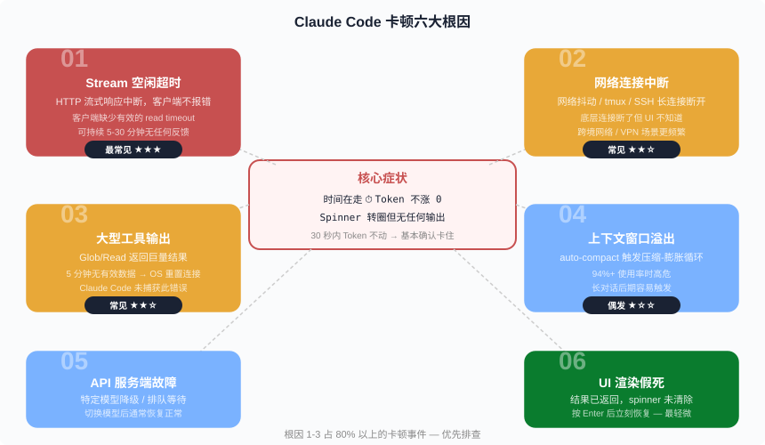
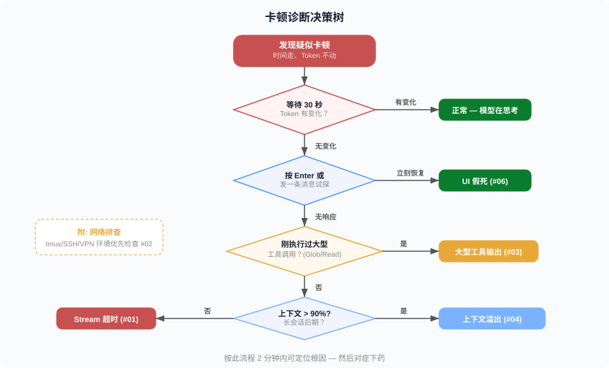
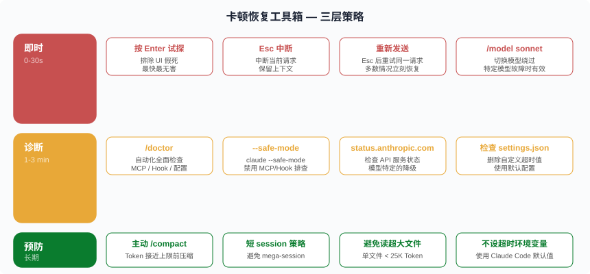

# 当 Claude Code 卡住不动 —— 六大根因与实战排查手册

> 前五篇讲了 Loop Engineering 的理论、实战、入门、全生命周期和成本优化。这一篇解决一个所有 Claude Code 用户迟早会遇到的问题：**Spinner 在转，时间在走，Token 不涨——Claude Code 卡住了。** 它不是一个 Bug，而是至少六种不同根因的共同表象。本文逐一拆解每种根因，给出判断方法和恢复手段。

**章节跳转：**[症状](#症状时间在走-token-不涨) · [六大根因](#六大根因) · [诊断决策树](#诊断决策树2-分钟定位根因) · [恢复工具箱](#恢复工具箱三层策略) · [反模式警告](#反模式警告让-claude-自己修自己) · [预防清单](#预防清单八条规则)

## 症状：时间在走，Token 不涨

你正在用 Claude Code 开发，突然发现：

- Spinner 仍在转圈（"Photosynthesizing…"、"Thinking…"）
- 右下角的时间正常递增：3m 21s … 5m 00s … 8m 35s
- 但 Token 数纹丝不动：↓ 301 tokens … ↓ 301 tokens … ↓ 301 tokens

**30 秒法则**：如果 30 秒内时间在涨但 Token 不动，可以基本确认卡住了。正常的"深度思考"会持续消耗 Thinking Token，数字不会完全静止。

这是 Claude Code 社区最高频的问题之一。GitHub 上有超过 10 个独立 issue 报告了完全相同的症状——从 2025 年 12 月至 2026 年 6 月，每个月都有新报告。

## 六大根因

"卡住"看起来一样，但背后的原因完全不同。诊断错了，恢复手段就用错了。



### 根因 1：Stream 空闲超时（最常见 ★★★）

**机制**：Claude Code 通过 HTTP 流式连接（SSE）从 Anthropic API 接收逐 Token 的响应。正常情况下，Token 一个接一个地"流"过来。但有时这个流会中断——API 端开始处理但不发数据，或者中间网关（CDN、反向代理）切断了连接。

**问题在于**：Claude Code 的 HTTP 客户端在某些场景下缺少有效的 read timeout。连接还"活着"，但没有数据流过。客户端就一直等——5 分钟、15 分钟、甚至 30 分钟——不报错、不重试、不给用户任何反馈。

**典型表现**：

- Token 完全静止，持续 5-30 分钟
- 没有错误信息
- 日志中可能出现 `ERR_STREAM_PREMATURE_CLOSE` 或 `AbortError`（但用户看不到）
- 发生时机随机，无明显触发条件

> **参考**：[GitHub #40057](https://github.com/anthropics/claude-code/issues/40057)、[#26092](https://github.com/anthropics/claude-code/issues/26092)、[#44921](https://github.com/anthropics/claude-code/issues/44921)

### 根因 2：网络连接中断（常见 ★★☆）

**机制**：底层 TCP 连接断了，但 Claude Code 的 UI 层不知道。Spinner 继续转，但数据永远不会来了。

**高危环境**：

- **tmux + SSH**：WiFi 中断 → SSH 隧道断开 → tmux 内的 Claude Code 连接失效。进程本身还活着（tmux 保护了它），但网络通道已经没了。
- **VPN / 跨境网络**：VPN 重连后 IP 变化，底层长连接失效。
- **企业代理**：公司网络的安全网关可能在空闲一段时间后切断连接。

**与根因 1 的区别**：根因 1 是 API 端不发数据，根因 2 是数据根本到不了你这里。恢复方式不同——根因 2 需要检查网络而非等待。

> **参考**：[GitHub #25286](https://github.com/anthropics/claude-code/issues/25286)

### 根因 3：大型工具输出导致连接重置（常见 ★★☆）

**机制**：当 Claude 指示 Claude Code 执行某个工具（如 `Glob` 搜索返回 90+ 文件路径，或 `Read` 读取一个巨大文件），工具执行本身可能需要较长时间。在此期间，API 连接上没有有效数据传输。如果 **5 分钟** 内没有有效数据通过底层 HTTP 连接，操作系统会重置连接。

**问题在于**：Claude Code 没有正确捕获这个连接重置错误。连接断了，但 UI 仍然显示在"工作中"。

**典型表现**：

- 卡顿恰好发生在工具调用之后
- 卡顿时间通常约 **5 分钟**（OS 的 TCP keep-alive 超时）
- 之前刚执行了返回大量结果的操作

> **参考**：[GitHub #44921](https://github.com/anthropics/claude-code/issues/44921)、[#13240](https://github.com/anthropics/claude-code/issues/13240)

### 根因 4：上下文窗口溢出触发 auto-compact 循环（偶发 ★☆☆）

**机制**：Claude Code 有一个 auto-compact 机制——当上下文使用率达到阈值（通常 ~94%）时，自动压缩历史对话。但如果压缩后立刻又读入一个大文件或大工具输出，上下文又迅速膨胀，再次触发压缩……形成死循环。

**典型表现**：

- 发生在长对话后期（Token 总数接近上限，如 156K/167K）
- 偶尔能看到 "Compacting…" 闪现
- 日志显示 terminal renderer 写缓冲区暴涨到 80-87KB/帧
- 延迟消息队列堆积到 700-1170 条

**第 05 篇的预防**：这正是为什么我们在 Token 经济学中强调"短 session 策略"和"主动 `/compact`"——不要等到系统被迫 auto-compact。

> **参考**：[GitHub #25286](https://github.com/anthropics/claude-code/issues/25286)、[#24478](https://github.com/anthropics/claude-code/issues/24478)

### 根因 5：API 服务端故障 / 模型特定降级（偶发 ★☆☆）

**机制**：Anthropic 的 API 可能经历部分服务降级——**特定模型**降级，而不是整个平台宕机。例如 Opus 排队严重，但 Sonnet 完全正常。你的请求发出去了，排在队列里，但服务端迟迟不开始处理。

**典型表现**：

- 切换模型后立刻恢复：`/model sonnet` → 正常工作
- 其他用户（或你自己在另一个 session 里用不同模型）没问题
- Anthropic 状态页可能显示"Degraded Performance"

> **参考**：[status.anthropic.com](https://status.anthropic.com)

### 根因 6：UI 渲染假死（Ghost Freeze）（最轻微）

**机制**：这是最无害但最令人困惑的情况。Claude 实际上已经返回了完整结果，API 调用已经结束，但终端 UI 的 spinner 没有清除。你看到的"卡住"其实是一个渲染 bug——数据已经在了，只是没显示出来。

**典型表现**：

- 按 Enter 或发送任何消息后，**立刻恢复**并直接开始下一轮
- 没有"刚才的回复"闪现——因为回复早就完成了
- 更常见于长 session、大输出之后

## 诊断决策树：2 分钟定位根因

不需要猜——按这个流程走就行。



**完整步骤**：

1. **等 30 秒**，观察 Token 数是否有任何变化
   - 有变化 → 正常，模型在深度思考（尤其 Opus 的 extended thinking 可能持续较久）
   - 无变化 → 继续

2. **按 Enter** 或输入任何文字
   - 立刻恢复 → **UI 假死**（根因 6），无需担心
   - 无响应 → 继续

3. **回忆刚才的操作**：是否刚执行过大型工具调用？（Glob 大量文件、Read 大文件、Bash 长输出）
   - 是 → 大概率是**大型工具输出**（根因 3），等 ~5 分钟或 Esc 中断
   - 否 → 继续

4. **检查上下文使用率**：Token 总数是否接近上限（> 90%）？
   - 是 → 可能是 **auto-compact 循环**（根因 4），Esc 中断后 `/compact` 或 `/clear`
   - 否 → 大概率是 **Stream 超时**（根因 1）或**网络中断**（根因 2）

5. **如果在 tmux/SSH/VPN 环境**：优先排查网络（根因 2），尝试在另一个终端 `ping api.anthropic.com`

## 恢复工具箱：三层策略



### 第一层：即时恢复（0-30 秒）

这些操作无损，可以随时尝试：

| 操作 | 命令 | 适用场景 |
|------|------|----------|
| **试探消息** | 按 Enter 或输入文字 | UI 假死 |
| **Esc 中断** | 按 `Esc` | 所有卡顿 |
| **重新发送** | Esc 后重新输入请求 | Stream 超时 |
| **切换模型** | `/model sonnet` | 模型特定故障 |

**操作顺序**：Enter 试探 → Esc 中断 → 重新发送 → 切模型。按这个顺序，从最无损到稍有代价，逐步升级。

### 第二层：诊断恢复（1-3 分钟）

如果即时恢复无效或问题反复出现：

```bash
# 自动化诊断
/doctor

# 安全模式启动（禁用所有 MCP 和 Hook）
claude --safe-mode

# 检查 Anthropic API 状态
# 在浏览器中打开 status.anthropic.com

# 检查是否有问题配置
cat ~/.claude/settings.json | grep -i timeout
```

**重点检查**：`settings.json` 中是否有自定义的超时环境变量。如果有，**删掉它们**（见下一节"反模式警告"）。

### 第三层：预防措施（长期）

这些习惯可以大幅减少卡顿的发生频率：

1. **主动 `/compact`**：不要等到 auto-compact 触发。Token 使用超过 70% 时手动压缩。
2. **短 session 策略**：完成一个完整的子任务后 `/clear` 开新 session，而非在一个 mega-session 里跑全部。（第 05 篇详述。）
3. **避免读入超大文件**：单文件超过 25K Token 会触发 `MaxFileReadTokenExceededError`。用 `--offset` 和 `--limit` 读取文件的特定部分。
4. **不手动设超时环境变量**：使用 Claude Code 的默认超时配置。

## 反模式警告：让 Claude 自己修自己

GitHub Issue [#51659](https://github.com/anthropics/claude-code/issues/51659) 记录了一个经典的反模式：

> 用户发现 Claude Code 频繁卡顿 → 让 Claude Code 自己诊断问题 → Claude Code 在 `settings.json` 中设置了超大的超时值 → **卡顿变得更严重**

具体来说，Claude Code 给自己加了这些配置：

```json
{
  "env": {
    "CLAUDE_STREAM_IDLE_TIMEOUT_MS": "900000",
    "API_TIMEOUT_MS": "1200000",
    "CLAUDE_CODE_MAX_RETRIES": "10",
    "MAX_THINKING_TOKENS": "12000",
    "CLAUDE_CODE_DISABLE_ADAPTIVE_THINKING": "1"
  }
}
```

**为什么这会让事情更糟**：

- `CLAUDE_STREAM_IDLE_TIMEOUT_MS: 900000` = **15 分钟** 的容忍窗口。正常情况下 Claude Code 几十秒就会超时重试；现在它会傻等 15 分钟。
- `API_TIMEOUT_MS: 1200000` = **20 分钟** 的 API 超时。
- 其他用户没有这个问题，正是因为他们用的是默认值。

**教训**：

1. **不要让 Claude Code 修改自己的超时配置。** 它不知道自己的客户端实现细节，会编造看起来合理但实际有害的配置。
2. 如果你的 `settings.json` 里有类似的 `env` 块，**直接删掉**。
3. Claude Code 的每一次"自我修复"都写进了 Memory，然后在后续 session 中反复引用这个错误的"修复方案"——形成**正反馈死循环**。

## 预防清单：八条规则

| # | 规则 | 原理 |
|---|------|------|
| 1 | 30 秒内 Token 不动 → 确认卡住 | 正常思考也会消耗 Token |
| 2 | 先按 Enter，再按 Esc | 排除 UI 假死后再中断 |
| 3 | 不手动设置超时环境变量 | 默认值是经过调优的 |
| 4 | Token > 70% 时主动 `/compact` | 预防 auto-compact 循环 |
| 5 | 完成子任务后 `/clear` 开新 session | 短 session 比 mega-session 稳定 |
| 6 | 单文件 < 25K Token | 超大文件触发读取错误 |
| 7 | tmux/SSH 用户加心跳保活 | `ServerAliveInterval 60` 防止连接断开 |
| 8 | 定期检查 `settings.json` 的 `env` 块 | 确认没有残留的问题配置 |

## 已知进展与展望

截至 2026 年 6 月，Anthropic 已经在 Claude Code 的多个版本中改进了超时处理和错误恢复。但核心问题（Stream 空闲超时无有效重试）尚未完全解决——GitHub 上每个月仍有新报告。

社区的共识是：

- **这是客户端问题**，不是 API 问题——API 超时后应该报错重试，而非静默等待
- **最有效的缓解手段是用户侧的习惯**——短 session、主动 compact、不碰超时配置
- **Anthropic 团队已知悉**——多个相关 issue 被标记为 duplicate 并指向核心 tracking issue [#25979](https://github.com/anthropics/claude-code/issues/25979)

---

**这一篇是实用排查手册，下次 Claude Code 卡住时直接翻到"诊断决策树"——2 分钟内定位根因，对症下药。**

---

## 参考来源

- [Claude Code Troubleshooting 官方文档](https://code.claude.com/docs/en/troubleshooting)
- [GitHub #44921 — Hangs with zero token consumption for 25-30 min](https://github.com/anthropics/claude-code/issues/44921)
- [GitHub #51659 — Freezes mid-response with zero token raise](https://github.com/anthropics/claude-code/issues/51659)
- [GitHub #26092 — Hangs without updating token usage](https://github.com/anthropics/claude-code/issues/26092)
- [GitHub #25286 — 100% write ratio in terminal renderer](https://github.com/anthropics/claude-code/issues/25286)
- [GitHub #12226 — Freezes with token consumption but no progress](https://github.com/anthropics/claude-code/issues/12226)
- [GitHub #40057 — Hangs with stagnant token usage until retry](https://github.com/anthropics/claude-code/issues/40057)
- [GitHub #31781 — Hangs with no token consumption](https://github.com/anthropics/claude-code/issues/31781)
- [GitHub #13240 — Hangs indefinitely during processing](https://github.com/anthropics/claude-code/issues/13240)
- [GitHub #24478 — CLI freezes requiring SIGKILL](https://github.com/anthropics/claude-code/issues/24478)
- [GitHub #20430 — Stuck in working state with 0 tokens](https://github.com/anthropics/claude-code/issues/20430)
