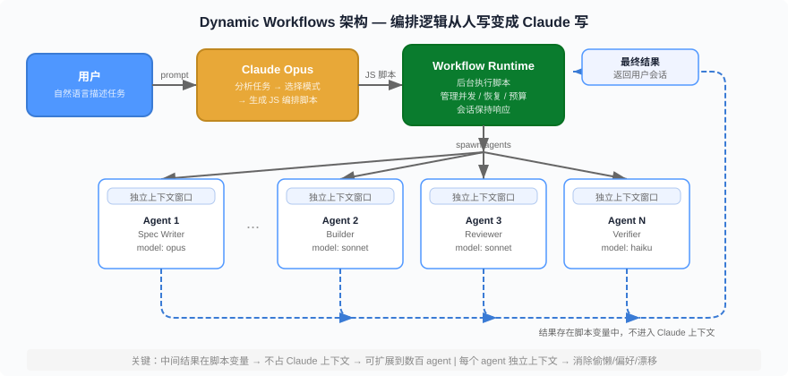
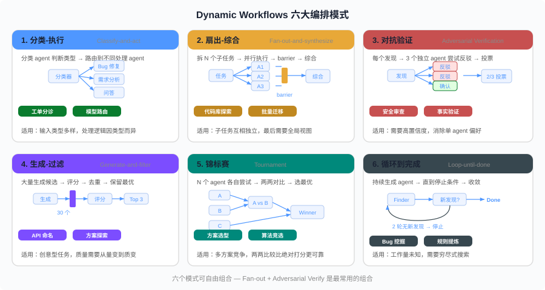
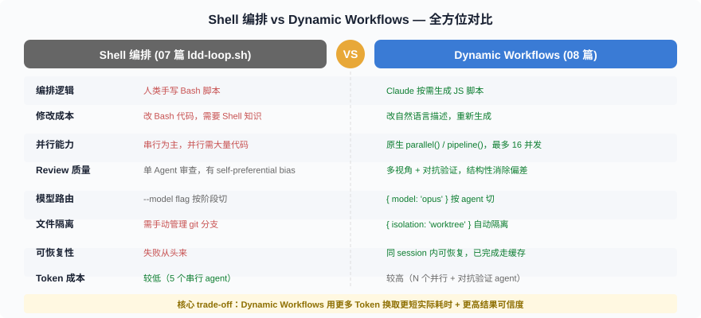

# Dynamic Workflows 实战 —— 从手写编排到 Claude 自己编排

> 前七篇讲了 Loop Engineering 的理论（01）、实战（02）、Hello World（03）、全生命周期 LDD（04）、Token 经济学（05）、卡顿排查（06）、模型编排（07）。07 篇用 Shell 脚本实现了"按阶段自动切模型"的编排——但编排逻辑还是你写的。这一篇回答 07 篇留下的悬念：**有没有办法连编排脚本都让 Claude 写？** 答案是 Dynamic Workflows——Claude 按需生成 JS 编排脚本，协调数十到数百个子 agent 并行工作。我们用 LinkShort 项目从零走一遍。

**章节跳转：**[问题](#问题shell-编排的三个天花板) · [核心概念](#核心概念什么是-dynamic-workflows) · [三种启动方式](#三种启动方式) · [六大编排模式](#六大编排模式) · [实战一：重写 LDD 流水线](#实战一用-workflow-重写-ldd-流水线) · [实战二：深度代码审查](#实战二用-workflow-做深度代码审查) · [实战三：项目探索](#实战三用-workflow-做项目探索) · [性能与成本](#性能与成本) · [什么时候不用](#什么时候不用-workflow) · [反直觉结论](#反直觉结论)

## 问题：Shell 编排的三个天花板

07 篇的 `ldd-loop.sh` 解决了"按阶段自动切模型 + 闭环重试"。但在实际使用中，它有三个天花板：

**天花板一：编排逻辑写死。** 脚本里写了五个阶段、两层循环、逃逸阀——改一个阶段就要改脚本。想在 Build 和 Review 之间加一个"安全扫描"阶段？改 Bash。想把 Review 从单 agent 改成三个独立审查员？改 Bash。每次需求变化都要人类改编排逻辑。

**天花板二：串行为主。** `ldd-loop.sh` 的 Build 阶段是一个 `claude -p` 调用——Agent 内部可能会串行处理 8 个任务。Task 3（POST /api/shorten）和 Task 5（GET /api/stats）之间没有依赖，完全可以并行。但 Shell 脚本要实现"按依赖关系并行"，代码量会膨胀三倍以上。

**天花板三：子 agent 之间无法对抗验证。** 07 篇的 Review 是一个 Agent 审查所有代码。但一个 Agent 审查自己项目的代码，会有 **self-preferential bias**——倾向于认为代码是对的。你需要多个独立 Agent 从不同角度审查，互相挑战对方的结论。这在 Shell 脚本里几乎无法实现。

**这三个天花板的根因是同一个：编排逻辑在人的手里。** 你要自己预判需要几个阶段、哪些可以并行、如何验证——然后把这些决策硬编码到 Bash 里。每个新项目、每个新需求都要重新写或改脚本。

Dynamic Workflows 的解法是：**把编排逻辑交给 Claude。**

## 核心概念：什么是 Dynamic Workflows

Dynamic Workflows 是 Claude Code 在 2026 年 5 月 28 日发布的功能（v2.1.154+，Research Preview）。

**一句话定义：Claude 按需生成一个 JS 编排脚本，运行时在后台执行这个脚本，协调数十到数百个子 agent 并行工作，每个子 agent 有独立的上下文窗口，中间结果存在脚本变量里而不是 Claude 的上下文窗口里。**



### 与 Shell 编排的关键区别

| 维度 | Shell 编排 (07 篇) | Dynamic Workflows |
|------|-------------------|-------------------|
| 编排逻辑 | 人类写 Bash 脚本 | Claude 写 JS 脚本 |
| 并行度 | 串行为主，并行需大量代码 | 原生支持 `parallel()` / `pipeline()` |
| 子 agent 隔离 | 每次 `claude -p` 独立 session | 每个 agent 独立上下文窗口 |
| 对抗验证 | 需要手动实现 | 内置模式，Claude 自动生成 |
| 中间结果 | 写文件传递 | 存在 JS 变量里 |
| 可重复性 | 脚本文件可重跑 | 脚本可保存为命令，`/ldd-build` 直接调用 |
| 可恢复性 | 失败从头来 | 同一 session 内可恢复，已完成的 agent 走缓存 |

### 解决的三个失效模式

为什么不能让一个 Agent 在一个上下文窗口里做完所有事？因为随着对话变长，Agent 会出现三种退化：

1. **Agentic Laziness（偷懒）**：复杂多步任务做到一半就宣布完成。比如安全审查 50 个文件，审完 35 个就说"剩余文件无明显问题"。
2. **Self-Preferential Bias（自我偏好）**：Agent 倾向于认为自己的产出是正确的。让同一个 Agent 先写代码再审查，它几乎不会发现自己的 bug。
3. **Goal Drift（目标漂移）**：长对话经过多次压缩（compaction），细节约束被丢失。"不要用 Math.random()"这种指令可能在第 5 次压缩后消失。

Dynamic Workflows 的解法：**每个子 agent 有独立上下文、独立目标、独立终止条件。** 写代码的 agent 不知道审查代码的 agent 存在，反之亦然——结构性消除偏好。

### 编排层级定位

回顾 01 篇的概念栈：

```
人类（决策者）
  ↓ 设计
Loop Engineering（系统设计方法论）
  ↓ 实现为
Harness（编排运行时）
  ↓ 驱动
Agent（LLM + 工具）
  ↓ 执行
Tools（文件、Shell、搜索、MCP）
```

Dynamic Workflows 在这个栈里的位置是 **Harness 层的升级**——从"人类手写 Harness"变成"Claude 按需生成 Harness"。你还是 Loop Engineer（决策者），但 Harness 的实现从手工变成了自动生成。

## 三种启动方式

### 方式一：自然语言请求

在 prompt 里直接说"用 workflow""run a workflow"：

```
帮我审查 src/routes/ 下所有 API 端点的认证检查，用 workflow 来做。
```

Claude 识别到你要求了 workflow，会生成一个 JS 编排脚本而不是逐轮执行。

### 方式二：ultracode 关键词

在 prompt 开头加 `ultracode`：

```
ultracode: 审查 src/routes/ 下所有 API 端点的认证检查
```

Claude Code 会高亮这个关键词，自动触发 workflow 模式。如果你不想触发，按 `Option+W`（macOS）或 `Alt+W`（Windows/Linux）取消高亮。

### 方式三：/effort ultracode（会话级）

```
/effort ultracode
```

开启后，Claude 对当前会话的**每个非平凡任务**都自动生成 workflow。不需要每次都写 `ultracode` 关键词。回到常规模式用 `/effort high`。

**适用场景选择**：

| 你想做什么 | 用哪种 |
|-----------|--------|
| 单个任务用一次 workflow | 方式一或方式二 |
| 整个 session 都用 workflow | 方式三 |
| 试试看效果 | 方式二（最直观） |
| 日常开发 + 偶尔用 workflow | 方式一（按需触发） |

## 六大编排模式

Claude 生成 workflow 脚本时，会从六个标准模式中选择和组合。了解这些模式有助于你在 prompt 中引导 Claude 选择合适的编排策略。



### 1. Classify-and-act（分类-执行）

**思路**：先用一个分类 agent 判断任务类型，再路由到不同的处理 agent。

**典型用例**：支持工单分诊——先分类（bug / feature request / question），再分别路由到修复 agent、需求分析 agent、问答 agent。

```
ultracode: 读取 issues/ 目录下的 50 个工单。
先分类（bug / feature / question），然后：
- bug → 尝试定位根因并生成修复建议
- feature → 提取需求要点写入 backlog
- question → 搜索文档生成回答
```

### 2. Fan-out-and-synthesize（扇出-综合）

**思路**：把任务拆成多个子任务，并行派发给多个 agent，等所有 agent 完成后综合结果。中间有一个 **barrier**（栅栏）——必须等所有扇出 agent 完成。

**典型用例**：代码库探索——每个子系统一个 agent，最后综合成架构地图。

```
ultracode: 探索这个 monorepo 的每个子包。
为每个子包启动一个 agent，输出：职责、核心类、对外 API、依赖关系。
最后综合成一张架构地图。
```

### 3. Adversarial Verification（对抗验证）

**思路**：对每个发现/结论，启动独立的 agent 尝试**反驳**。只有经过反驳仍然成立的结论才保留。

**典型用例**：安全审查——发现潜在漏洞后，让另一个 agent 尝试证明"这不是真正的漏洞"。经过对抗仍然确认的才报告。

```
ultracode: 审查 src/ 下的安全漏洞。
每发现一个疑似漏洞，启动 3 个独立 agent 尝试反驳。
2/3 认为是真实漏洞的才保留。
```

**这是 Dynamic Workflows 最有价值的模式。** 单 agent 审查的误报率高——它倾向于"宁可多报不可漏报"。对抗验证结构性地消除了这个偏差。

### 4. Generate-and-filter（生成-过滤）

**思路**：先大量生成候选方案，然后用质量标准过滤，去重后保留最优。

**典型用例**：API 命名——生成 20 个候选名称，按可读性、一致性、简洁性打分，保留 top 3。

```
ultracode: 给这个 CLI 工具起名。
生成 30 个候选名称，按以下标准打分：
- 可记忆性
- 与功能的关联度
- 是否与已有工具重名
保留 top 5。
```

### 5. Tournament（锦标赛）

**思路**：N 个 agent 各自尝试同一个任务，然后两两比较（pairwise comparison），像淘汰赛一样选出最优。

**典型用例**：方案选型——让 3 个 agent 分别用不同架构实现同一个功能，然后用评审 agent 两两对比选最优。

```
ultracode: 实现 LinkShort 的短码生成算法。
启动 3 个 agent，分别用：
- nanoid 随机生成
- Base62 自增编码
- CRC32 哈希截取
然后用评审 agent 按碰撞率、性能、可预测性两两对比，选出最优方案。
```

**比起绝对打分，两两比较的判断更可靠**——这是来自人类认知科学的结论。

### 6. Loop-until-done（循环到完成）

**思路**：持续生成 agent 直到满足停止条件（没有新发现、所有错误已修复、预算用完）。

**典型用例**：Bug 挖掘——反复扫描代码库找 bug，直到连续两轮没有新发现。

```
ultracode: 扫描整个代码库找 bug。
每轮启动一批 finder agent 从不同角度找。
连续 2 轮没有新发现则停止。
已找到的 bug 用对抗验证确认。
```

### 模式组合

这六个模式不是互斥的。Claude 生成的 workflow 通常是多个模式的组合：

| 任务 | 常见组合 |
|------|---------|
| 代码迁移 | Fan-out（每个文件一个 agent）+ Adversarial Verify（合并前审查） |
| 深度研究 | Fan-out（多角度搜索）+ Generate-and-filter（去重）+ Adversarial Verify（验证声明） |
| 代码审查 | Fan-out（多维度审查）+ Adversarial Verify（确认发现） |
| 方案选型 | Generate（多方案）+ Tournament（两两对比） |
| LDD 全流程 | Pipeline（阶段串联）+ Fan-out（并行 Build）+ Adversarial Verify（多角度 Review） |

## 实战一：用 Workflow 重写 LDD 流水线

**继续用第 04 篇的 LinkShort 项目。** 同样是从 Spec 到 Accept 的五阶段，但这次不写 Shell 脚本——让 Claude 自己生成编排。

### Step 1：启动第一个 Workflow

在 Claude Code 里输入：

```
ultracode: 用 LDD 方法开发一个 URL 短链接服务（LinkShort）。

需求：把长 URL 变成短链接，点击短链接跳转到原始 URL，能看到点击统计。
技术栈：Node.js + Hono + SQLite + Drizzle ORM + Vitest + Docker。

分五个阶段串行执行：
1. Spec: 生成 docs/spec.md（API 端点、数据模型、验收条件）
2. Plan: 生成 docs/plan.md（任务拆分、依赖关系、实现顺序）
3. Build: 按 plan 逐个实现任务，每个任务跑通测试再继续
4. Review: 审查代码，检查安全性和规格符合性
5. Accept: 对照 spec 中的验收条件逐条验证

Spec 和 Plan 用 opus 模型，Build 和 Review 用 sonnet，Accept 用 haiku。
```

Claude 会生成一个 JS 编排脚本。按下 `Yes` 开始运行前，你可以按 `Ctrl+G` 打开脚本查看：

```javascript
export const meta = {
  name: 'ldd-linkshort',
  description: 'LDD five-phase pipeline for LinkShort URL shortener',
  phases: [
    { title: 'Spec', detail: 'Generate structured requirements' },
    { title: 'Plan', detail: 'Create implementation plan and task list' },
    { title: 'Build', detail: 'Implement all tasks with tests' },
    { title: 'Review', detail: 'Code review for security and correctness' },
    { title: 'Accept', detail: 'Verify acceptance criteria from spec' },
  ],
}

// Phase 1: Spec
phase('Spec')
const spec = await agent(
  `你是产品架构师。根据以下需求生成 docs/spec.md：
   需求：URL 短链接服务，长 URL 变短链接，点击跳转，点击统计。
   技术栈：Node.js + Hono + SQLite + Drizzle ORM + Vitest + Docker。
   要求：列出 API 端点、数据模型、边界条件、验收条件。`,
  { model: 'opus', label: 'spec-writer' }
)

// Phase 2: Plan
phase('Plan')
const plan = await agent(
  `你是技术 Lead。读取 docs/spec.md，生成 docs/plan.md。
   要求：任务拆分（粒度 30 分钟内）、依赖关系、实现顺序。`,
  { model: 'opus', label: 'plan-writer' }
)

// Phase 3: Build
phase('Build')
const build = await agent(
  `你是高级开发者。读取 docs/plan.md，按顺序实现所有任务。
   每个任务写完运行测试，通过才继续。全部完成后运行完整测试套件。`,
  { model: 'sonnet', label: 'builder' }
)

// Phase 4: Review
phase('Review')
const review = await agent(
  `你是代码审查专家。运行 git diff 查看所有改动。
   检查：逻辑正确性、安全漏洞、性能问题、规格符合性。
   发现严重问题直接修复。输出审查报告到 docs/review.md。`,
  { model: 'sonnet', label: 'reviewer' }
)

// Phase 5: Accept
phase('Accept')
const accept = await agent(
  `你是 QA 工程师。读取 docs/spec.md 中的验收条件，逐条验证。
   启动服务，对每个条件执行验证。输出 docs/acceptance.md。`,
  { model: 'haiku', label: 'acceptor' }
)
```

**对比 07 篇的 `ldd-pipeline.sh`（68 行 Bash）：**

| 维度 | ldd-pipeline.sh | Dynamic Workflow |
|------|----------------|-----------------|
| 编排逻辑 | 你写的 | Claude 生成的 |
| 改阶段 | 改 Bash 脚本 | 改 prompt 描述 |
| 模型指定 | `--model` flag | `{ model: 'opus' }` |
| 错误处理 | `set -euo pipefail` | Runtime 自动处理 |
| 中间结果 | 写文件 + `check_file()` | 脚本变量 |

**核心区别：你不再需要写编排代码。** 你描述"做什么"，Claude 决定"怎么编排"。

**运行后的产出**（跟 04 篇一样，每个阶段生成一个文件）：

```
linkshort/
├── CLAUDE.md                    # 你事先写好的（技术栈 + 规范）
├── docs/
│   ├── spec.md                  # Phase 1 Spec agent 产出
│   ├── plan.md                  # Phase 2 Plan agent 产出
│   ├── review.md                # Phase 4 Review agent 产出
│   └── acceptance.md            # Phase 5 Accept agent 产出
├── src/                         # Phase 3 Build agent 产出
│   ├── index.ts
│   ├── routes/
│   │   ├── shorten.ts
│   │   ├── redirect.ts
│   │   └── stats.ts
│   └── db/
│       └── schema.ts
├── tests/                       # Phase 3 Build agent 产出
│   └── api.test.ts
└── Dockerfile                   # Phase 3 Build agent 产出
```

**跟 04 篇的区别不在产出——产出一模一样。区别在过程：04 篇你手动跑 5 个 `claude -p`，07 篇你写 Bash 脚本跑 5 个 `claude -p`，08 篇 Claude 自己生成脚本跑 5 个 agent。**

### Step 2：审批和观察

Claude 生成脚本后，会弹出审批界面：

| 选项 | 说明 |
|------|------|
| **Yes, run it** | 开始执行 |
| **Yes, and don't ask again** | 开始执行，以后这个 workflow 不再询问 |
| **View raw script** | 查看 JS 脚本源码 |
| **No** | 取消 |

选 `Yes` 后，workflow 在后台运行。你的 session **保持可用**——可以继续做别的事。

用 `/workflows` 查看进度：

```
/workflows
```

进度界面显示每个 Phase 的 agent 数量、token 用量和耗时。常用操作：

| 按键 | 功能 |
|------|------|
| `↑` / `↓` | 选择 Phase 或 Agent |
| `Enter` / `→` | 展开详情（prompt、工具调用、结果） |
| `Esc` | 返回上级 |
| `j` / `k` | 在 Agent 详情里滚动 |
| `p` | 暂停 / 恢复 |
| `x` | 停止选中的 agent 或整个 workflow |
| `r` | 重启选中的 agent |
| `s` | 保存脚本为命令 |

输入框下方的任务面板也会显示一行进度摘要。按 `↓` 聚焦，按 `Enter` 展开。

**进度界面实际看起来是这样的**：

```
╭ ldd-linkshort ──────────────────────────────────────────────╮
│                                                              │
│  ✅ Spec          1 agent    12.3k tokens    48s             │
│  ✅ Plan          1 agent    15.1k tokens    62s             │
│  🔄 Build         1 agent    45.2k tokens    3m 21s  ◀      │
│  ⏳ Review        —          —               —               │
│  ⏳ Accept        —          —               —               │
│                                                              │
│  Total: 3 agents   72.6k tokens   5m 11s                    │
│                                                              │
│  ↑↓ Select  Enter Drill in  p Pause  x Stop  s Save         │
╰──────────────────────────────────────────────────────────────╯
```

选中 `Build` 按 `Enter` 可以展开看这个 agent 正在做什么——它的 prompt、最近的工具调用（比如正在跑 `pnpm test`）、已产出的文件。

**关键体验差异：Workflow 在后台跑，你可以继续在同一个 session 里做别的事。** 比如边等 Build 边问 Claude 别的问题。Shell 脚本跑起来会占住终端，你只能等着或者开新终端。

### Step 3：加入对抗验证——多 Agent Review

Step 1 的 Review 只有一个 Agent。这跟 07 篇的 Shell 编排没有本质区别。Dynamic Workflows 的真正威力在于：**你可以用自然语言描述更复杂的编排，Claude 自动生成对应的脚本。**

把 prompt 改成：

```
ultracode: 用 LDD 方法开发 LinkShort 短链接服务。

（Spec、Plan、Build 同上，省略...）

Review 阶段用对抗验证：
- 启动 3 个独立的 Review agent，各自在独立上下文中工作：
  - Agent 1: 安全视角 — 检查注入、XSS、认证绕过、路径穿越
  - Agent 2: 性能视角 — 检查 N+1 查询、内存泄漏、并发问题
  - Agent 3: 规格符合性 — 对照 spec 逐条验证功能实现
- 每个 agent 独立输出发现列表
- 对每个发现，启动一个验证 agent 尝试反驳（"这真的是问题吗？"）
- 2/3 验证 agent 确认是真实问题的才保留
- 所有确认的问题修复后再进入 Accept
```

Claude 生成的脚本会变成：

```javascript
// Phase 4: Review — 三视角对抗验证
phase('Review')

// 三个独立审查 agent 并行运行
const reviews = await parallel([
  () => agent(
    '从安全视角审查代码：注入、XSS、认证绕过、路径穿越。输出发现列表。',
    { model: 'sonnet', label: 'review:security', phase: 'Review' }
  ),
  () => agent(
    '从性能视角审查代码：N+1 查询、内存泄漏、并发问题。输出发现列表。',
    { model: 'sonnet', label: 'review:performance', phase: 'Review' }
  ),
  () => agent(
    '从规格符合性视角审查代码：对照 docs/spec.md 逐条验证实现。输出发现列表。',
    { model: 'sonnet', label: 'review:spec-compliance', phase: 'Review' }
  ),
])

// 汇总所有发现，去重
const allFindings = reviews.filter(Boolean).flatMap(r => r.findings || [])
log(`三视角审查共发现 ${allFindings.length} 个问题，开始对抗验证`)

// 对每个发现启动验证 agent
phase('Verify')
const verified = await pipeline(
  allFindings,
  finding => parallel([
    () => agent(`尝试反驳这个发现："${finding.desc}"。默认立场是"这不是问题"。`, 
                { label: `verify:${finding.file}` }),
    () => agent(`尝试反驳这个发现："${finding.desc}"。默认立场是"这不是问题"。`, 
                { label: `verify2:${finding.file}` }),
    () => agent(`尝试反驳这个发现："${finding.desc}"。默认立场是"这不是问题"。`, 
                { label: `verify3:${finding.file}` }),
  ]).then(votes => ({
    ...finding,
    confirmed: votes.filter(Boolean).filter(v => !v.refuted).length >= 2,
  }))
)

const confirmedFindings = verified.filter(f => f.confirmed)
log(`对抗验证后保留 ${confirmedFindings.length}/${allFindings.length} 个确认问题`)

// 修复确认的问题
if (confirmedFindings.length > 0) {
  phase('Fix')
  await agent(
    `修复以下确认的问题：${JSON.stringify(confirmedFindings)}`,
    { model: 'sonnet', label: 'fixer' }
  )
}
```

**对比 Shell 脚本实现同样功能的代码量：**

| 功能 | Shell 脚本 | Dynamic Workflow |
|------|-----------|-----------------|
| 3 个并行 Review Agent | ~40 行 Bash（后台进程 + wait + 合并输出） | `parallel([...])` 一个调用 |
| 对抗验证（3 票制） | ~60 行 Bash（循环 + 临时文件 + 投票统计） | `pipeline()` + `parallel()` 嵌套 |
| 汇总 + 去重 + 修复 | ~30 行 Bash | 几行 JS 内联 |
| **总计** | **~130 行 Bash** | **~40 行 JS（Claude 自动生成）** |

而且你不需要写那 40 行 JS——你只需要用自然语言描述"三视角对抗验证"，Claude 替你生成。

**对抗验证的产出示例**（`docs/review.md`）：

```markdown
## 三视角审查报告

### 安全视角 (Agent 1)
- [S-01] src/routes/shorten.ts:12 — 未校验 URL 协议，可传入 javascript: 协议
  → 对抗验证：2/3 确认 ✅ 真实漏洞（一个验证者认为前端会过滤，但服务端不应依赖前端）
- [S-02] src/routes/redirect.ts:8 — 开放重定向，可被钓鱼利用
  → 对抗验证：3/3 确认 ✅ 确实是 OWASP 标准问题
- [S-03] src/db/schema.ts:15 — 短码用 Math.random() 生成，可预测
  → 对抗验证：1/3 确认 ❌ 过滤（两个验证者指出短链接本身是公开的，可预测性不构成安全风险）

### 性能视角 (Agent 2)
- [P-01] src/routes/redirect.ts:15 — 点击记录同步写入，阻塞重定向响应
  → 对抗验证：3/3 确认 ✅ 影响 p99 延迟
- [P-02] src/routes/stats.ts:8 — 每次请求都 COUNT(*)，无缓存
  → 对抗验证：2/3 确认 ✅ 高频访问时有性能问题

### 规格符合性 (Agent 3)
- [C-01] spec 要求"相同 URL 返回相同短码"，实现中每次都生成新码
  → 对抗验证：3/3 确认 ✅ 功能缺失

### 汇总
- 原始发现：6 个
- 对抗验证后保留：5 个（过滤 1 个误报 S-03）
- 已自动修复：5/5 ✅
```

**注意 S-03 被对抗验证过滤了。** 单 agent 审查会把它报为"安全问题"，但两个独立验证者指出短码本身是公开信息——这就是对抗验证的价值：**不是多几个人看，是让不同的 agent 互相挑战前提假设。**

### Step 4：加入并行 Build——pipeline vs parallel

Step 1 的 Build 是一个 Agent 串行做 8 个任务。但 LinkShort 的任务之间有明确的依赖关系：

```
Task 1: 初始化项目        ─┐
Task 2: 数据库 schema      ─┤ 串行（有依赖）
                           │
Task 3: POST /api/shorten  ─┤
Task 4: GET /:code          ─┼─ 并行（互相独立）
Task 5: GET /api/stats      ─┤
                           │
Task 6: 边界处理            ─┤ 依赖 3,4,5
Task 7: 写测试             ─┤ 依赖 3,4,5,6
Task 8: Dockerfile          ─  独立（可与任何阶段并行）
```

改 prompt：

```
ultracode: 用 LDD 方法开发 LinkShort 短链接服务。

（Spec、Plan 同上...）

Build 阶段按依赖关系并行：
- 阶段 A: Task 1-2（基础设施）串行执行
- 阶段 B: Task 3, 4, 5（核心 API）并行执行，每个任务用独立 worktree 隔离
- 阶段 C: Task 6（边界处理）等阶段 B 全部完成后执行
- 阶段 D: Task 7（测试）等阶段 C 完成后执行
- Task 8（Docker）与阶段 B 同时启动，独立并行

（Review 用三视角对抗验证，同 Step 3...）
```

Claude 生成的 Build 部分会使用 `pipeline` 和 `parallel` 的组合：

```javascript
// Phase 3: Build — 按依赖关系编排
phase('Build')

// 阶段 A: 基础设施（串行）
await agent('初始化项目结构 + package.json + tsconfig', 
  { model: 'sonnet', label: 'build:init' })
await agent('定义数据库 schema（links 表 + clicks 表）', 
  { model: 'sonnet', label: 'build:schema' })

// 阶段 B + Task 8: 并行
await parallel([
  // 核心 API — 每个任务独立 worktree
  () => agent('实现 POST /api/shorten', 
    { model: 'sonnet', label: 'build:shorten', isolation: 'worktree' }),
  () => agent('实现 GET /:code 重定向', 
    { model: 'sonnet', label: 'build:redirect', isolation: 'worktree' }),
  () => agent('实现 GET /api/stats/:code', 
    { model: 'sonnet', label: 'build:stats', isolation: 'worktree' }),
  // Docker — 独立并行
  () => agent('创建 Dockerfile + docker-compose.yml', 
    { model: 'sonnet', label: 'build:docker', isolation: 'worktree' }),
])

// 阶段 C: 边界处理（依赖阶段 B）
await agent('实现边界处理：URL 校验、短码冲突、过期检查', 
  { model: 'sonnet', label: 'build:edge-cases' })

// 阶段 D: 测试（依赖阶段 C）
await agent('编写测试覆盖 spec 中的 7 个验收条件', 
  { model: 'sonnet', label: 'build:tests' })
```

#### pipeline vs parallel：什么时候用哪个？

这是 Dynamic Workflows 最重要的设计决策：

| 场景 | 用 pipeline | 用 parallel |
|------|------------|-------------|
| 每个 item 独立流过所有阶段 | ✅ | |
| 需要所有结果一起才能继续 | | ✅ |
| 需要跨 item 去重/合并 | | ✅ |
| 想最大化墙钟效率 | ✅ | |
| 阶段 N 需要阶段 N-1 全部完成 | | ✅（barrier） |

**口诀：默认用 `pipeline`，只有需要 barrier（跨 item 上下文）时才用 `parallel`。**

`pipeline` 不等待：Item A 可以在 stage 3 而 Item B 还在 stage 1。墙钟时间 = 最慢的单 item 链。

`parallel` 是 barrier：等所有 thunk 完成才返回。墙钟时间 = 最慢的那个 thunk。

#### worktree 隔离：什么时候用？

`isolation: 'worktree'` 让 agent 在独立的 git worktree 里工作。开销约 200-500ms + 磁盘空间。

**只在 agent 并行修改文件且会互相冲突时才用。** 比如 Task 3 和 Task 4 都可能改 `src/index.ts` 的路由注册——不隔离会产生合并冲突。如果 agent 只是读代码不写代码（比如 Review），不需要 worktree。

#### 并行 Build 的效果对比

串行 Build（Step 1）vs 并行 Build（Step 4）的墙钟时间：

```
Step 1 串行 Build（1 个 agent）:
  Task1 ─ Task2 ─ Task3 ─ Task4 ─ Task5 ─ Task6 ─ Task7 ─ Task8
  ├─2m──┤─2m──┤─4m──────┤─3m────┤─3m────┤─3m────┤─4m────┤─2m──┤
  总计: ~23 分钟

Step 4 并行 Build（8 个 agent，4 个并行）:
  Task1 ─ Task2 ┬ Task3 ──┬ Task6 ─ Task7
                 ├ Task4 ──┤
                 ├ Task5 ──┤
                 └ Task8   │
  ├─2m──┤─2m──┤─4m──────┤─3m────┤─4m────┤
  总计: ~15 分钟（节省 35%）
```

Token 总量几乎不变（每个 task 做的工作量一样），但墙钟时间少了三分之一。**并行不省 Token，省的是你等待的时间。**

### Step 5：保存和复用

跑完一次 workflow 之后，你可以保存为命令：

1. 运行 `/workflows`
2. 选择要保存的 run
3. 按 `s`
4. 选择保存位置：

| 位置 | 作用域 | 路径 |
|------|--------|------|
| 项目 | 所有克隆这个仓库的人都能用 | `.claude/workflows/` |
| 个人 | 只有你自己、所有项目可用 | `~/.claude/workflows/` |

保存后，下次直接用 `/ldd-linkshort` 调用。

#### 用 args 参数化

保存的 workflow 可以通过 `args` 接收参数：

```
运行 /ldd-linkshort，需求是"在线投票系统，支持创建投票、投票、查看结果"
```

Claude 会把需求文本传入 `args`，脚本里用 `args` 读取：

```javascript
const requirement = args  // "在线投票系统，支持创建投票、投票、查看结果"
phase('Spec')
const spec = await agent(`根据需求生成 docs/spec.md：${requirement}`, ...)
```

**这就是 Shell 脚本 `./ldd-loop.sh "需求描述"` 的 workflow 等价物——但不需要你维护 Bash 脚本。**

## 实战二：用 Workflow 做深度代码审查

Claude Code 有 `/code-review` 命令，但它是单 agent、单上下文窗口的审查。对大型 PR，你可以用 workflow 做更深入的多维度审查。

### 完整 Prompt

```
ultracode: 审查当前分支相对于 main 的所有改动。

审查维度（每个维度一个独立 agent）：
1. 正确性：逻辑错误、边界遗漏、类型安全
2. 安全性：OWASP Top 10、注入、认证、敏感数据
3. 性能：复杂度、N+1 查询、内存分配、缓存策略
4. 可维护性：命名、抽象层次、重复代码、测试覆盖

每个维度的发现用结构化 schema 输出：
{ file, line, severity, description, suggestion }

每个维度的发现用对抗验证确认（3 票制，2/3 确认才保留）。
最后生成一份合并报告，按严重程度排序，写入 docs/deep-review.md。
```

### Claude 生成的脚本

```javascript
export const meta = {
  name: 'deep-review',
  description: 'Multi-dimension code review with adversarial verification',
  phases: [
    { title: 'Review', detail: '4-dimension parallel review' },
    { title: 'Verify', detail: 'Adversarial verification of findings' },
    { title: 'Report', detail: 'Merge, dedup, and generate report' },
  ],
}

const FINDING_SCHEMA = {
  type: 'object',
  properties: {
    findings: {
      type: 'array',
      items: {
        type: 'object',
        properties: {
          file: { type: 'string' },
          line: { type: 'number' },
          severity: { enum: ['blocker', 'warning', 'nit'] },
          dimension: { type: 'string' },
          description: { type: 'string' },
          suggestion: { type: 'string' },
        },
        required: ['file', 'line', 'severity', 'dimension', 'description'],
      },
    },
  },
}

const VERDICT_SCHEMA = {
  type: 'object',
  properties: {
    refuted: { type: 'boolean' },
    reason: { type: 'string' },
  },
}

const DIMENSIONS = [
  { key: 'correctness', prompt: '从正确性审查代码：逻辑错误、边界遗漏、类型安全...' },
  { key: 'security', prompt: '从安全性审查代码：OWASP Top 10、注入、认证...' },
  { key: 'performance', prompt: '从性能审查代码：复杂度、N+1 查询、内存...' },
  { key: 'maintainability', prompt: '从可维护性审查代码：命名、抽象、重复、测试覆盖...' },
]

// Phase 1: 四维度并行审查
phase('Review')
const reviews = await parallel(
  DIMENSIONS.map(d => () =>
    agent(`运行 git diff main...HEAD。${d.prompt}`, {
      label: `review:${d.key}`,
      phase: 'Review',
      schema: FINDING_SCHEMA,
    })
  )
)

const allFindings = reviews.filter(Boolean).flatMap(r => r.findings)
log(`四维度审查共发现 ${allFindings.length} 个问题`)

// Phase 2: 对抗验证
phase('Verify')
const verified = await pipeline(
  allFindings,
  f => parallel(
    Array.from({ length: 3 }, (_, i) => () =>
      agent(
        `审查这个发现是否是真实问题。默认立场是"这不是问题"。
         发现：${f.description}（${f.file}:${f.line}）
         你的任务是尝试反驳它。只有确实无法反驳时才设 refuted=false。`,
        { label: `verify${i}:${f.file}:${f.line}`, schema: VERDICT_SCHEMA }
      )
    )
  ).then(votes => ({
    ...f,
    confirmed: votes.filter(Boolean).filter(v => !v.refuted).length >= 2,
    votes: votes.filter(Boolean).map(v => v.reason),
  }))
)

const confirmed = verified.filter(f => f.confirmed)
log(`对抗验证后保留 ${confirmed.length}/${allFindings.length}`)

// Phase 3: 生成报告
phase('Report')
await agent(
  `将以下审查结果写入 docs/deep-review.md：
   ${JSON.stringify(confirmed, null, 2)}
   按 severity 排序：blocker > warning > nit。
   对每个发现附上投票理由摘要。`,
  { label: 'report-writer' }
)
```

**注意 `schema` 参数：** 给 agent 传入 JSON Schema，可以强制子 agent 返回结构化数据。不需要你解析文本输出——runtime 会在工具调用层面验证，格式不对自动重试。这就是 07 篇 Shell 脚本里用 `grep` 和 `extract_verdict()` 函数勉强解析文本的升级版。

### 产出示例

```markdown
## Deep Review Report

### Blockers (2)

| # | 维度 | 文件:行号 | 描述 | 投票 |
|---|------|----------|------|------|
| 1 | security | src/routes/shorten.ts:12 | 未校验 URL 协议，可传入 javascript: | 3/3 确认 |
| 2 | correctness | src/routes/shorten.ts:28 | 相同 URL 应返回相同短码，当前每次生成新码 | 3/3 确认 |

### Warnings (3)

| # | 维度 | 文件:行号 | 描述 | 投票 |
|---|------|----------|------|------|
| 3 | performance | src/routes/redirect.ts:15 | 点击记录同步写入阻塞重定向 | 3/3 确认 |
| 4 | performance | src/routes/stats.ts:8 | COUNT(*) 无缓存 | 2/3 确认 |
| 5 | security | src/routes/redirect.ts:8 | 开放重定向 | 2/3 确认 |

### 过滤的误报 (2)

| # | 原始发现 | 过滤原因 |
|---|---------|---------|
| 6 | Math.random() 短码可预测 | 2/3 反驳：短码是公开信息，可预测不构成安全风险 |
| 7 | 缺少 rate limiting | 2/3 反驳：MVP 阶段可接受，非功能缺陷 |

统计：7 个发现 → 5 个确认 + 2 个过滤
```

### 与 `/code-review` 的区别

| 维度 | /code-review | Workflow 深度审查 |
|------|-------------|-----------------|
| Agent 数 | 1 | 4 审查 + N×3 验证 |
| 上下文 | 共享（大 PR 会压缩丢失细节） | 每个 agent 独立（聚焦单一维度） |
| 输出格式 | 自由文本 | 结构化 Schema（可机器处理） |
| 误报率 | 较高（单 agent 倾向多报） | 较低（对抗验证过滤，示例中过滤了 2/7） |
| Token 消耗 | 低（~20k） | 高（~150-200k） |
| 墙钟时间 | ~3 分钟 | ~8 分钟（并行抵消了 agent 数增加） |
| 适用场景 | 日常 PR | 关键发布、安全敏感代码、上线前终审 |

### 什么时候值得 5-10x 的 Token？

- **PR 改动超过 500 行**：单 agent 上下文压力大，容易偷懒跳过后半段
- **涉及认证/支付/个人数据**：安全维度需要专门的深度检查
- **新手写的代码要合并到核心模块**：可维护性审查价值最高
- **发布前最后一道关**：误报低比覆盖全更重要

日常 5-50 行改动的 PR → `/code-review` 足够。

## 实战三：用 Workflow 做项目探索

新加入一个大代码库，想快速了解全貌。这个场景不需要对抗验证——没有对错之分，只是收集信息。核心模式是 **Fan-out-and-synthesize**。

### 完整 Prompt

```
ultracode: 我刚加入这个项目，帮我全面了解代码库架构。

Phase 1 — 并行探索：
为 src/ 下的每个顶级子目录启动一个 agent，独立分析：
- 目录的核心职责（一句话）
- 关键文件列表（带一行说明）
- 对外暴露的接口（导出的函数/类/路由）
- 依赖了哪些其他目录
- 使用的设计模式（如有）
- 代码量（文件数 + 行数）

Phase 2 — 综合：
汇总所有 agent 的分析，生成 ARCHITECTURE.md：
- 系统概览（一段话）
- 模块依赖关系（Mermaid 图）
- 入口点和请求流程
- 技术栈清单
- 潜在架构问题（循环依赖、过度耦合）
```

### Claude 生成的脚本

```javascript
export const meta = {
  name: 'codebase-explore',
  description: 'Parallel exploration of codebase architecture',
  phases: [
    { title: 'Explore', detail: 'One agent per top-level directory' },
    { title: 'Synthesize', detail: 'Merge into ARCHITECTURE.md' },
  ],
}

const MODULE_SCHEMA = {
  type: 'object',
  properties: {
    directory: { type: 'string' },
    responsibility: { type: 'string' },
    keyFiles: { type: 'array', items: { type: 'object', properties: {
      path: { type: 'string' }, description: { type: 'string' }
    }}},
    exports: { type: 'array', items: { type: 'string' } },
    dependencies: { type: 'array', items: { type: 'string' } },
    patterns: { type: 'array', items: { type: 'string' } },
    stats: { type: 'object', properties: {
      files: { type: 'number' }, lines: { type: 'number' }
    }},
  },
}

// Phase 1: 并行探索
phase('Explore')

// 先获取目录列表
const dirs = await agent(
  '列出 src/ 下的所有顶级子目录名称，返回一个字符串数组。',
  { label: 'list-dirs', schema: { type: 'object', properties: {
    dirs: { type: 'array', items: { type: 'string' } }
  }}}
)

const explorations = await parallel(
  dirs.dirs.map(dir => () =>
    agent(
      `深入分析 src/${dir}/ 目录。
       读取目录下所有文件，分析每个文件的职责。
       总结：核心职责、关键文件、对外接口、依赖、设计模式、代码量统计。`,
      { label: `explore:${dir}`, phase: 'Explore', schema: MODULE_SCHEMA }
    )
  )
)

log(`探索完成：${explorations.filter(Boolean).length} 个模块`)

// Phase 2: 综合
phase('Synthesize')
await agent(
  `根据以下模块分析结果，生成 ARCHITECTURE.md：
   ${JSON.stringify(explorations.filter(Boolean), null, 2)}
   
   要求：
   1. 系统概览（一段话）
   2. 模块依赖关系图（Mermaid flowchart 格式）
   3. 请求入口和处理流程
   4. 技术栈清单
   5. 架构问题（循环依赖、过度耦合、孤立模块）`,
  { label: 'synthesizer' }
)
```

### 产出示例（ARCHITECTURE.md 片段）

```markdown
## 系统概览

LinkShort 是一个 URL 短链接服务，基于 Node.js + Hono + SQLite 构建。
共 4 个核心模块，~800 行代码，采用分层架构（路由 → 服务 → 数据访问）。

## 模块依赖关系

​```mermaid
flowchart TD
    routes --> db
    routes --> utils
    db --> schema
    utils -.-> db
​```

## 模块清单

| 模块 | 职责 | 文件数 | 行数 | 依赖 |
|------|------|--------|------|------|
| routes/ | HTTP 路由处理 | 3 | 210 | db, utils |
| db/ | 数据库访问层 | 2 | 150 | schema |
| utils/ | 工具函数（短码生成、URL 校验） | 2 | 80 | — |
| config/ | 配置管理 | 1 | 40 | — |

## 架构问题
- ⚠️ utils/ 有一处直接导入了 db/，违反了分层原则
- ✅ 无循环依赖
- ✅ 无孤立模块
```

### 进阶：结合 /loop 持续维护

探索不是一次性的。代码库每天在变。结合 `/loop` 可以持续维护架构文档：

```
/loop 30m ultracode: 检查最近 30 分钟的 git 变更（git log --since="30 minutes ago"），
如果有新的文件或目录变更，更新 ARCHITECTURE.md 中的受影响模块。
如果没有变更，输出"无变更"即可。
```

这就是 01 篇讲的"Loop 不是一次性脚本，是持续运行的系统"在架构文档上的应用。

## 实战四：用 Workflow 做 Session 经验挖掘

这是 Anthropic 博客里提到的一个强力用例：**从你过去的 Claude Code session 中挖掘反复出现的修正模式，提炼成 CLAUDE.md 规则。**

```
ultracode: 分析我最近 50 个 Claude Code session，找出我反复做的修正。

Phase 1 — 挖掘：
并行分析每个 session 的对话记录，提取：
- 我否定 Claude 输出的地方（"不对"、"改回来"、"不要这样"）
- 我补充约束的地方（"记住要..."、"别忘了..."）
- 相同修正出现超过 2 次的模式

Phase 2 — 聚类：
把所有修正按主题聚类（命名、架构、测试、安全、风格...）

Phase 3 — 验证：
对每个候选规则，用对抗验证确认：
"如果这条规则写在 CLAUDE.md 里，它是否能防止过去的某次真实错误？"
只保留能通过验证的规则。

Phase 4 — 输出：
把确认的规则按优先级写入 CLAUDE.md 补丁建议。
```

**这是 Loop-until-done + Adversarial Verify 的组合。** 挖掘 session 数量不固定，聚类后的规则需要对抗验证确认真实价值（不是所有修正都值得变成规则）。

产出：

```markdown
## 建议添加到 CLAUDE.md 的规则

### 高优先级（出现 5+ 次，验证通过）
1. 测试文件必须和源文件放在同一目录（`__tests__/` 而非顶级 `tests/`）
   → 来源：12 个 session 中修正过文件位置
2. API 路由必须先校验输入再执行逻辑，不要在逻辑中间校验
   → 来源：8 个 session 中修正过校验位置

### 中优先级（出现 3-4 次，验证通过）
3. commit message 用中文，不要用英文
   → 来源：6 个 session 中修正过语言

### 过滤（验证未通过）
- "不要用 any 类型" → 反驳：有些场景确实需要 any（如泛型边界）
- "函数不超过 30 行" → 反驳：过于机械，有些函数天然较长
```

## 进阶技巧

### 技巧一：用 Schema 驱动结构化输出

实战二展示了 `schema` 参数。这是 Dynamic Workflows 最被低估的能力之一。

**没有 Schema 时：**

```javascript
const result = await agent('审查代码，列出发现的问题')
// result 是自由文本："我发现了 3 个问题：\n1. 在 foo.ts 第 12 行..."
// 你需要解析文本来提取结构化数据 → 脆弱、不可靠
```

**有 Schema 时：**

```javascript
const result = await agent('审查代码，列出发现的问题', {
  schema: {
    type: 'object',
    properties: {
      findings: {
        type: 'array',
        items: {
          type: 'object',
          properties: {
            file: { type: 'string' },
            line: { type: 'number' },
            severity: { enum: ['blocker', 'warning', 'nit'] },
            description: { type: 'string' },
          },
          required: ['file', 'line', 'severity', 'description'],
        },
      },
    },
  },
})
// result.findings 直接是结构化数组，可以 .filter() / .map() / .sort()
// 格式不对 runtime 自动重试，不需要你写解析代码
```

**这解决了 07 篇 Shell 脚本里最脆弱的一环**——`extract_verdict()` 函数用 `grep` 解析 Agent 的文本输出来判断 PASS/NEEDS_FIX。Agent 输出格式稍有变化（比如写了 "Verdict: Pass" 而不是 "VERDICT: PASS"），解析就失败。Schema 在工具调用层面保证格式正确。

### 技巧二：用 budget 动态控制深度

不知道需要扫描多少轮？用 `budget` 动态决定：

```javascript
const bugs = []
while (budget.total && budget.remaining() > 50000) {
  const result = await agent(
    `扫描代码库找 bug。已找到的 bug（跳过这些）：
     ${bugs.map(b => b.description).join('\n')}`,
    { schema: BUGS_SCHEMA }
  )
  const newBugs = result.bugs.filter(b => !bugs.some(existing => existing.file === b.file && existing.line === b.line))
  if (newBugs.length === 0) break  // 没有新发现，提前停止
  bugs.push(...newBugs)
  log(`已找到 ${bugs.length} 个 bug，剩余 ${Math.round(budget.remaining()/1000)}k tokens`)
}
```

设预算的方式：

```
ultracode: 审查代码安全性。预算 100k tokens。
```

没有设预算时 `budget.total` 是 `null`，`budget.remaining()` 返回 `Infinity`——所以 `while` 循环前**必须检查 `budget.total`**，否则会跑到 1,000 agent 上限。

### 技巧三：用 agentType 复用专业 agent

workflow 里的 agent 默认用通用型。但你可以指定 `agentType` 来复用已有的专业 agent：

```javascript
// 用 Explore agent（只读，不会修改文件）做初步分析
const analysis = await agent('分析 src/auth/ 的认证流程', {
  agentType: 'Explore',
  schema: AUTH_FLOW_SCHEMA,
})

// 用 code-reviewer agent 做专业审查
const review = await agent('审查 src/auth/ 的安全性', {
  agentType: 'code-reviewer',
})
```

`agentType` 从注册表解析——跟 Agent 工具的 `subagent_type` 一样。专业 agent 有针对性的 system prompt，质量通常更高。

### 技巧四：/goal + /loop + Workflow 组合

三个机制组合使用，实现"持续自主达标"：

```
/goal 代码库零 blocker 级安全问题

/loop 1h ultracode: 扫描代码库安全性。
对每个发现用对抗验证。
确认的 blocker 直接修复。
修复后重新验证。
```

- `/goal` 定义了终止条件——零 blocker
- `/loop` 定义了节奏——每小时一次
- `ultracode` 确保每次扫描都用 workflow 的多 agent 对抗模式

这就是 01 篇描述的"持续运行的自主系统"在安全扫描上的实例。

### 技巧五：Workflow 里调 Workflow

`workflow()` 函数可以在脚本里调用另一个已保存的 workflow：

```javascript
// 先跑 deep-research 调研技术方案
phase('Research')
const research = await workflow('deep-research', '短码生成的最佳实践和碰撞率分析')

// 基于调研结果执行实现
phase('Build')
await agent(`根据以下调研结果实现短码生成模块：${JSON.stringify(research)}`)
```

嵌套只支持一层——workflow 里的 workflow 里不能再套 workflow。但一层嵌套足以实现"先调研再实施"的模式。

## 性能与成本



### 约束参数

| 参数 | 值 | 说明 |
|------|-----|------|
| 最大并发 | 16 agents | CPU 核心少则更低 |
| 单次上限 | 1,000 agents | 防止失控循环 |
| 模型选择 | 按 agent 指定 | `{ model: 'opus' }` |
| worktree 隔离 | 按 agent 开启 | `{ isolation: 'worktree' }` |
| 可恢复性 | 同一 session 内 | 已完成 agent 走缓存 |

### 预算控制

在 prompt 中设置 token 预算：

```
ultracode: 审查代码安全性。预算 50k tokens。
```

workflow 脚本可以用 `budget.remaining()` 动态调整行为：

```javascript
while (budget.total && budget.remaining() > 30000) {
  const result = await agent('继续扫描未覆盖的文件...')
  findings.push(...result.findings)
  log(`已找到 ${findings.length} 个问题，剩余 ${Math.round(budget.remaining()/1000)}k tokens`)
}
```

### 成本对比

以 LinkShort 的 LDD 全流程为例（估算）：

| 方案 | Agent 数 | 预估 Token | 预估成本 | 墙钟时间 |
|------|---------|-----------|---------|---------|
| 手动 prompt（04 篇） | 5 次交互 | ~100k | ~$0.50 | ~50 分钟（含人工） |
| Shell 编排（07 篇） | 5 个 `claude -p` | ~120k | ~$0.60 | ~40 分钟（全自动） |
| DW 基础版（Step 1） | 5 agents | ~130k | ~$0.65 | ~35 分钟 |
| DW 对抗验证版（Step 3） | 5 + 3 review + 9 verify | ~300k | ~$1.50 | ~25 分钟 |
| DW 并行 Build 版（Step 4） | 12+ agents | ~350k | ~$1.75 | ~18 分钟 |

**核心 trade-off：Token 成本换墙钟时间和结果可信度。** 并行 Build 加对抗验证的方案 Token 用量是 Shell 编排的 3 倍，但墙钟时间缩短一半，且发现的问题更准确（误报率更低）。

## 什么时候不用 Workflow

Workflow 不是银弹。以下场景不需要：

| 场景 | 为什么不需要 | 用什么替代 |
|------|------------|-----------|
| 简单 Bug 修复 | 单 agent 一轮搞定 | 直接 prompt |
| 改一个文件的几行代码 | 编排开销 > 任务本身 | 直接 prompt |
| 常规 PR Review | `/code-review` 够用 | `/code-review` |
| 快速问答 | 不需要并行 | 直接 prompt |

**判断框架：问自己"这个任务需要多个独立视角吗？"** 如果答案是否，不需要 workflow。

同时，workflow 的 Token 消耗显著高于常规方式。一个有 5 个 reviewer 的 workflow 消耗的 Token 可能是单次审查的 10 倍。**不要给钉子用锤子。**

## 反直觉结论

> **Dynamic Workflows 的价值不是"更多 agent"，是"更可信的结果"。**

大多数人第一反应："Workflow 就是并行跑更多 Agent 来加速"。错了。**并行只是手段，目的是结构性消除单 agent 的认知偏差。** 一个 Agent 审查 50 个文件和五个 Agent 各审查 10 个文件，Token 总量差不多——但后者不会因为上下文过长而偷懒跳过后面的文件。对抗验证不是为了"多几个 Agent 看"，是为了**让 Agent 之间互相挑战**——这是单 agent 架构无论如何也做不到的。

更反直觉的：**Prompt 比以前更重要了，不是更不重要。** 07 篇你写 Shell 脚本时，编排逻辑是你自己的代码——你精确控制每一步。Dynamic Workflows 里，你用自然语言描述编排意图，Claude 翻译成 JS 脚本。如果你的描述模糊（"审查代码"），Claude 生成的 workflow 就是单 agent 审查。如果你的描述精确（"三视角对抗验证，2/3 确认才保留"），Claude 生成的 workflow 就有真正的对抗结构。**你不再写 Bash 了，但你在写"让 Claude 写 Bash 的 prompt"——你是 harness 的 harness 设计者。** 这是 01 篇"从写 prompt 到写生成 prompt 的系统"的又一层递归。

最反直觉的：**Dynamic Workflows 是 Loop Engineering 的终极形态——从"你写 loop"到"Claude 写 loop"。** 01 篇的核心洞察是"把 prompter 的角色从人类手里拿走"。04 篇把这个洞察应用到全生命周期（五阶段 LDD）。07 篇用 Shell 脚本自动化了 LDD 的编排。08 篇（本文）把编排本身也交给了 Claude。演进路径是清晰的：

```
手动 prompt → Shell 脚本编排 → Dynamic Workflows
（你 prompt Agent）  （你写系统 prompt Agent）  （Claude 写系统 prompt Agent）
```

每一步都把一层控制权交给自动化。但注意：**你始终是决策者——你决定"审查几个维度""用什么模式""什么时候需要对抗验证"。** Claude 执行你的决策，但决策本身还是你的。Loop Engineer 的角色没有消失，只是杠杆率又提高了一个数量级。

---

## 配图

1. 
2. 
3. 

---

📌 系列阅读地图：[reading-map.md](../reading-map.md)
🔗 上一篇: [07 模型编排实战](./07-model-orchestration.md)
